# Velociraptor 

In this lab we will be installing and using **Velociraptor** to look at the various IR artifacts on your computer.

Check out their website here:

<pre>https://www.velocidex.com/</pre>

Velociraptor is a free **EDR** that can help us better understand of the inner workings of a computer.

Furthermore, it is an excellent example of commercial tools you will encounter in your security career.

They also have offer training on their tool if you want to dig deeper.

<pre>https://www.velocidex.com/training/</pre>

Let's get started.

Open a **Windows command prompt**.


When the terminal opens, navigate to the appropriate directory by using the following command:

```bash
cd \IntroLabs
```

For this installation, we are going to set up **Velociraptor** as a standalone deployment.  This means the server and the client will be run on the same system.

Within the command prompt, run the following command:

```bash
velociraptor-v0.75.6-windows-amd64.exe config generate -i
```

When it asks about the **Deployment Type**, choose **Self Signed SSL**


When it asks about the **OS**, please choose **Windows**.


When it asks about the **Path to the datastore**, **just hit enter**.  This will keep the default.


When it asks about the path to the **logs directory**, **just hit enter** to accept the default.


When it asks about the **PKI Certificate Expiration**, **just hit enter** to accept the default.


When it asks about the **Registry for Client Writeback**, **just hit enter** to accept the default.


When it asks about the **DNS name**, **just hit enter**.  It will set the default to localhost.  This will work fine as we are just running this locally.


When asked about which **DNS Type** is used, select **None** and press enter.


If prompted about using **Experimental Websocket**, enter **"No"**


For the **default ports**, once again, **just hit enter** twice to accept 8000 and 8889 as the defaults.


When it asks about the **Username and Password**, **just hit enter** twice to leave them empty.


When it asks about the **Name of file** of the config file, **just hit enter** to accept the default.


Let’s add a **GUI** user.

```bash
velociraptor-v0.75.6-windows-amd64.exe --config server.config.yaml user add root --role administrator
```

When it asks for the password, please choose a password you will remember.

When finished, it should look similar to 


Lets run the **msi** to load the proper files to the proper directories:

```bash
velociraptor-v0.75.6-windows-amd64.msi
```

Time to start the server.

```bash
velociraptor-v0.75.6-windows-amd64.exe --config server.config.yaml frontend -v
```

This will take some time, be patient.

There will be some red text.  **Don’t panic.**

Surf to the **GUI** and see if it worked!

<pre>https://127.0.0.1:8889</pre>

When you load the page, there will be an **SSL error** about the self-signed cert.  That is fine.

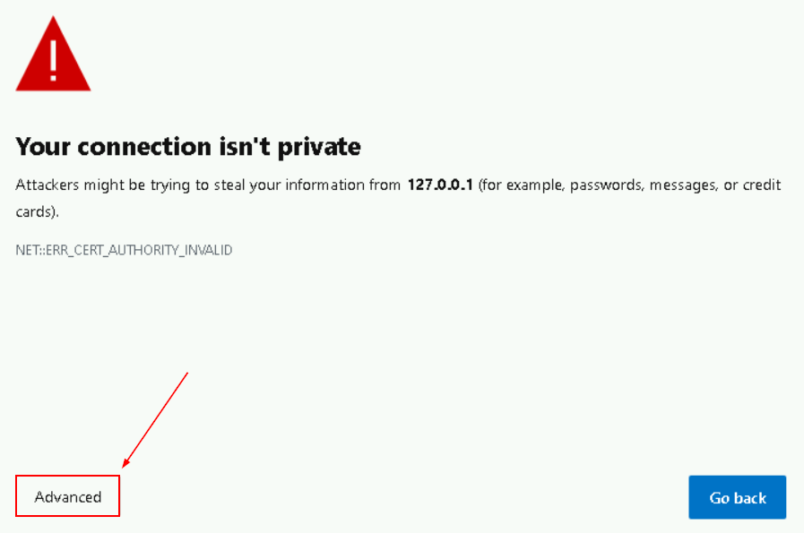

Select Advanced then proceed to **127.0.0.1**

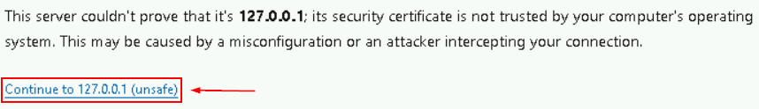

When it asks for the Username and Password, please enter root and the password you chose earlier.

Please select **Inspect** the server's state.

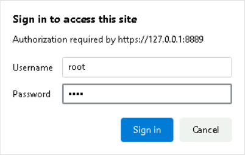

Once logged in, you will see the following:

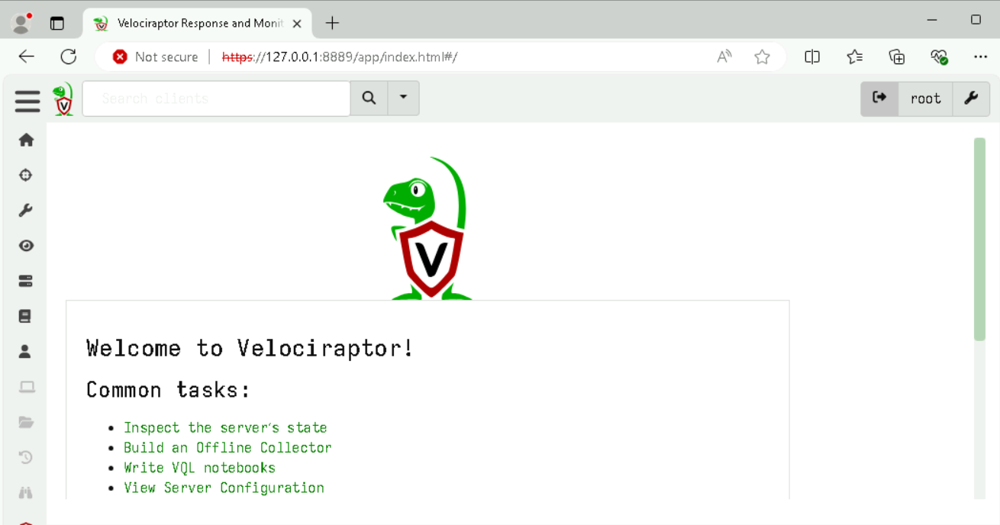

Next, we need to start the client. Lucky for us, it is the same executable.

We will need to open another **Windows Command Prompt**. Right click on the terminal icon in the task bar, and select **"command prompt"**:


Then Navigate to the **IntroLabs** directory.

```bash
cd \IntroLabs
```

We will need to start the client.  To do this will need to run the **MSI** first.

```bash
velociraptor-v0.75.6-windows-amd64.msi
```

When you get the pop up, select Run.  This will install the proper libraries and files.

Next, we will start the client.

```bash
velociraptor-v0.75.6-windows-amd64.exe --config server.config.yaml client -v
```

It will look something like this:


Now, let’s go back to the Velociraptor GUI and select the Home button in the upper left.

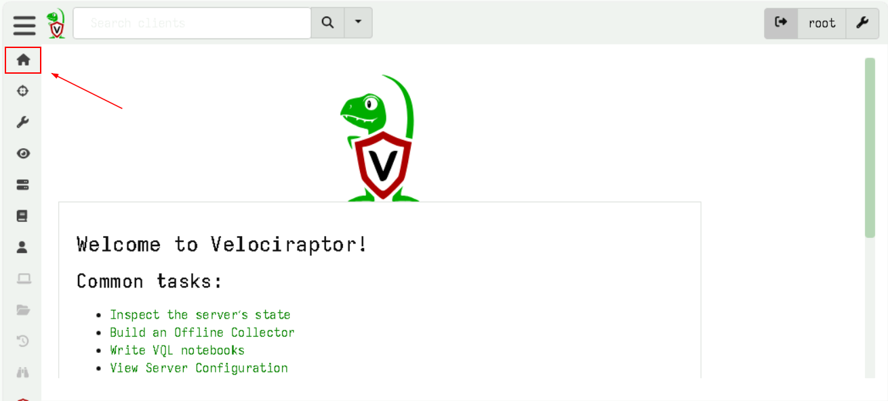

You should see **one** connected client.


Now let’s look at what we can do with this.

This is **not** necessarily a detection platform.  It is designed to allow you to dig when you get an **alert** on malware signatures or from suspicious traffic. 

Understand, it is not a replacement for **AV!**

Let’s **"Show All"** Clients. Go to the search bar at the top of the screen, hit the dropdown.  

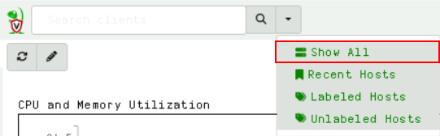

As you can see below there will only be one client.

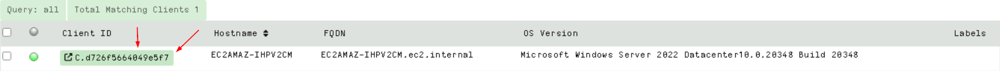

If you select that client, you can get additional information about that system.

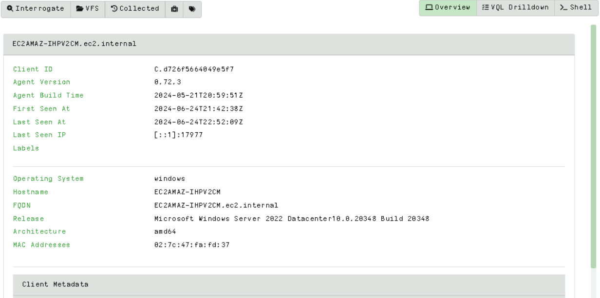

Now, on the top right of the window, select **Shell**.

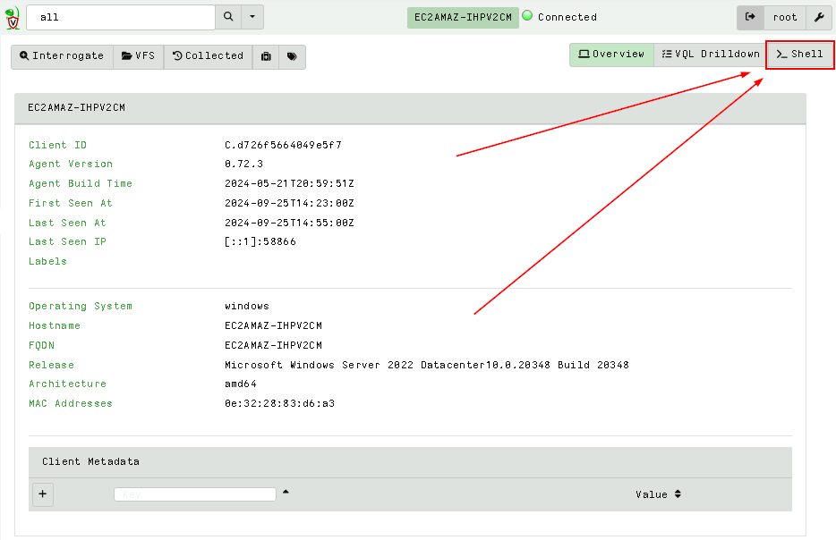

This allows us to run commands on the target system.  Think of the commands that we ran from the **Windows CLI**, we can run those here too.

Please click on the **PowerShell** box and select **Cmd**.

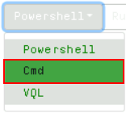

Now, enter `netstat -naob` in the cmd box and select **"Launch"**.


This will not display the results right away. To see the results, select the **"Eye"** icon:

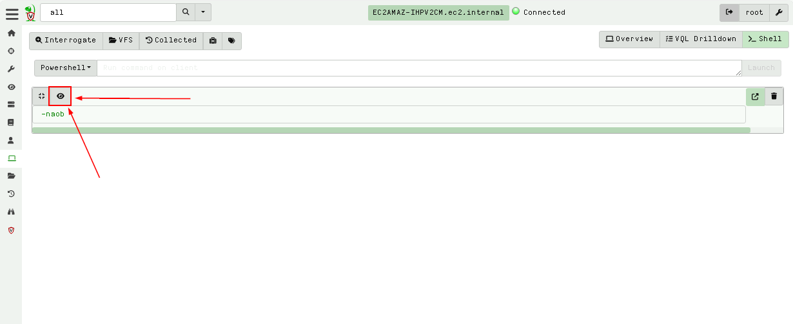

Now you can see the results, click **Active Connections**:


Now click the **Text** tab


Let’s do a Hunt.   Please select the Hunt icon.

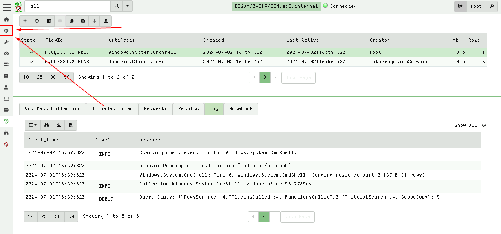

To start a Hunt, please select the **"+"** icon.

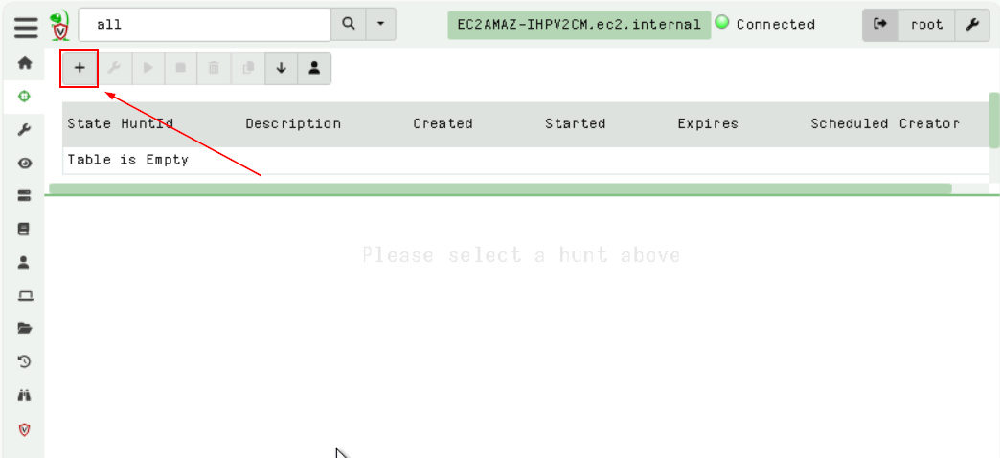

Name your Hunt, then select **"Select Artifacts"** on the bottom.

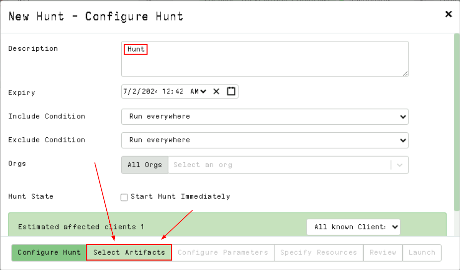

Within the window, scroll down to find **"Generic.System.Pstree"** and select it.

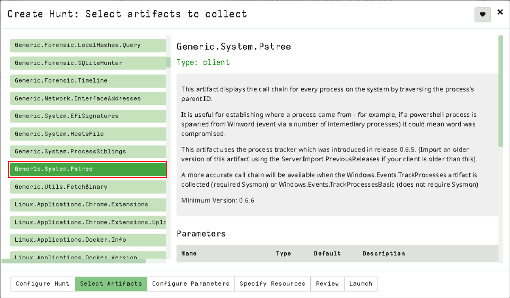

Review on the bottom.

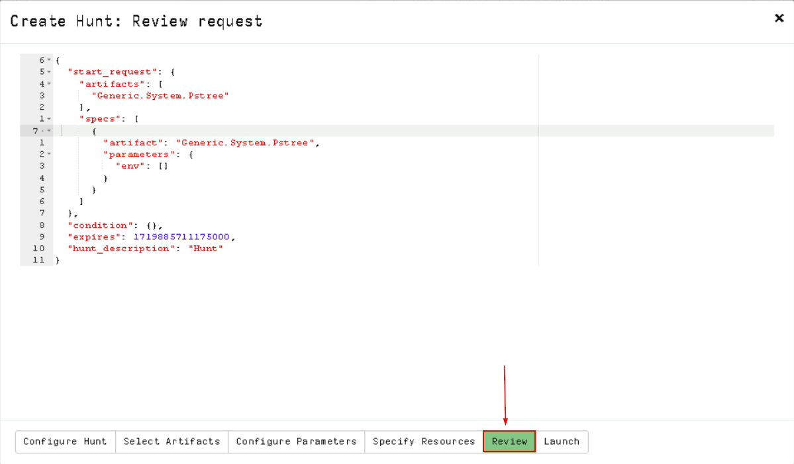

We now have an overview of what is going to be run on all systems.  Which in our case, is only one system.

Now select Launch.

It will start the Hunt and load it in the **queue**.

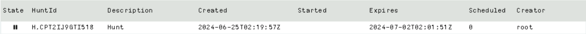

Please select our Hunt.  Now, we can run it.  Press the **Play** button above.

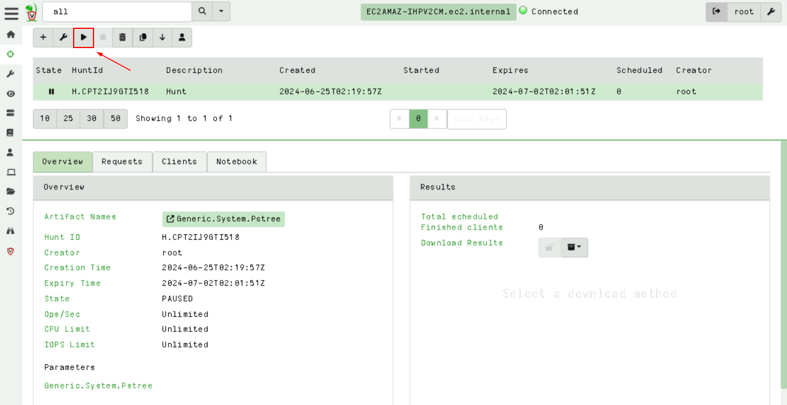

When you get the pop-up, select **Run them all!**

>[!NOTE]
>
>This will take a few moments.

When done, you will see **"Total scheduled is 1"** and **"Finished Clients is 1"**.

You can also download the results.

Please select **Download Results.**

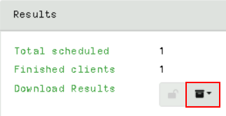

Then, **Summary (CSV Only)**.


This will create a zip with the output.

Please download that by clicking on the **zip file**.

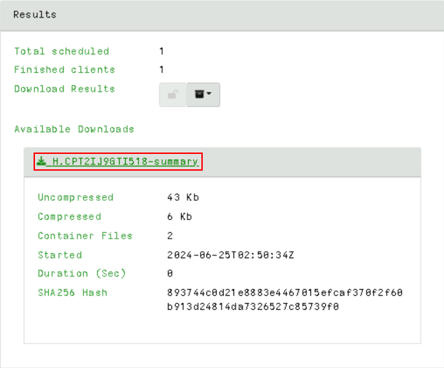

Go ahead and open the **zip file**, navigate into the results folder.

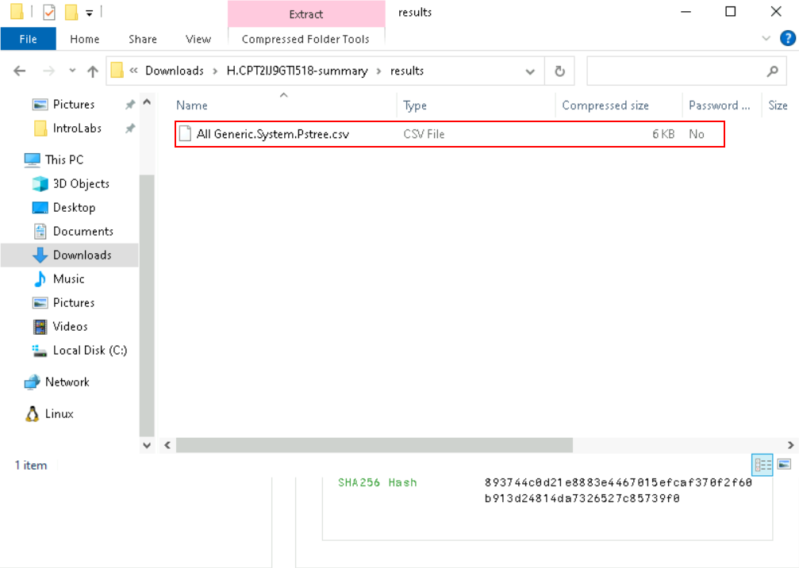

Then, open the csv file with **NotePad**.

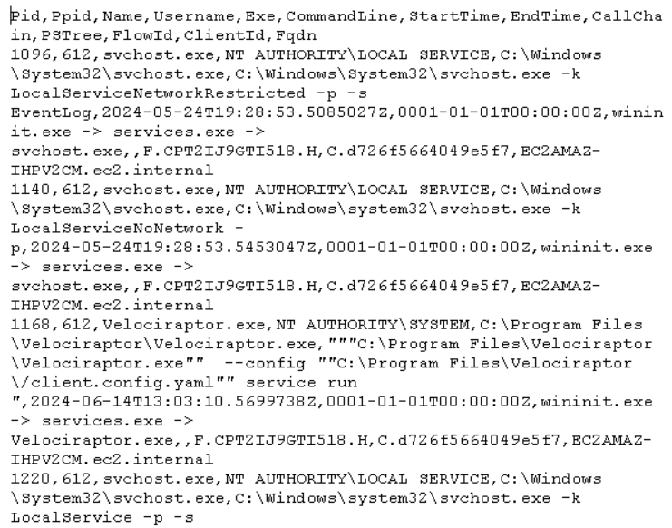

Granted, this is not optimal.  We did not load **Excel** on this system because of licensing restrictions.  However, you can copy this over to your host system and open it there. 

However, of you want to see a simple HTML report you can click on the turn back time icon on the left side (Right above the binoculars) and then clock Download Results > Prepare Collection Report, then click on the HTML report that appears below it.

We have not even begun to touch what we can do with this awesome tool.

Want to try something cool?  Run a **Meterpreter agent** on you Windows system.  Then, go through **Velociraptor** to create a Hunt to find it.  There are many Windows artifacts you can pull.  You do not need to just run one at a time.  You can run multiple.


---

# Finished?

[Back to Endpoint_Security_Protection_Analysis's Main Page](/Cards/DET/Endpoint_Security_Protection_Analysis.md)


[Back to Endpoint_Analysis's Main Page](/Cards/DET/Endpoint_Analysis.md)

[Back to Server_Analysis's Main Page](/Cards/DET/Server_Analysis.md)


[Back to Memory_Analysis's Main Page](/Cards/DET/Memory_Analysis.md)

