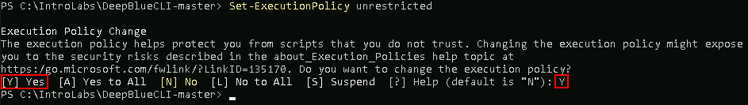
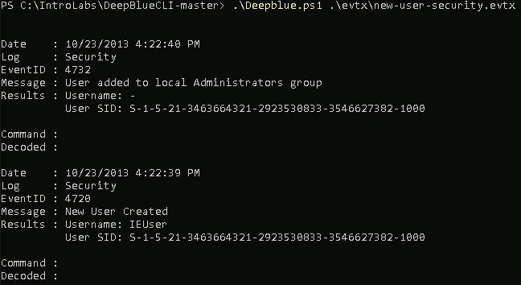
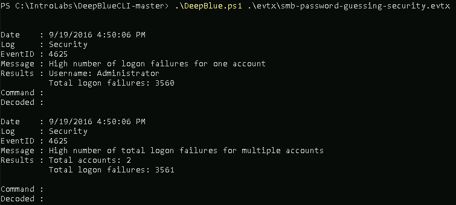
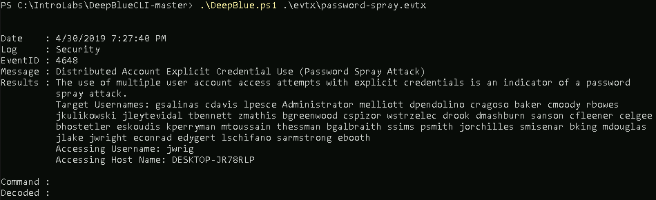
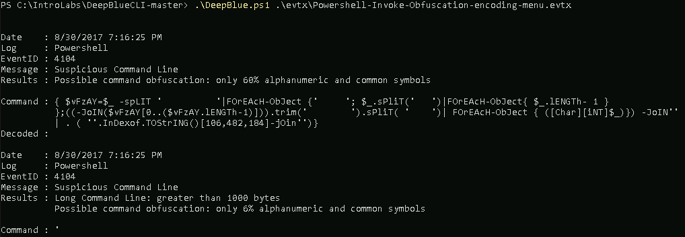

# DeepBlueCLI

DeepBlueCLI is a free tool by **Eric Conrad** that demonstrates some amazing detection capabilities.  It also has some checks that are effective for showing how **UEBA** style techniques can be in your environment. 

Let's get started by opening **Windows Powershell**.


Next, we need to navigate to the **IntroLabs** directory:

```ps
cd \IntroLabs
```

Then, continue into the **DeepBlueCLI-master** directory:

```ps
cd .\DeepBlueCLI
```

Run the following command:

```ps
Set-ExecutionPolicy Unrestricted
```

Most likely, you will be prompted to confirm the change.

Please enter **"Y"** for Yes.



It is very common for attackers to add additional users on to a system they have compromised.  This gives them a level of persistence that they otherwise would not gain with malware.  Why?  There are lots and lots of tools to detect malware.  By creating an extra user account it allows them to blend in.  

Now, let’s run a check in the **.evtx** files for adding a new user:

```ps
.\DeepBlue.ps1 .\evtx\new-user-security.evtx
```

You should see the following:



Another attack that very few **SIEMs** detect is password spraying.  This is where an attacker takes a user list from a domain, and sprays it with the same password, think **"Summer2020"**.  This is effective because it keeps the lockout threshold below the lockout policy and many times flies under the radar simply because accounts are not getting locked out. 

This is the exact behavior that **UEBA** should be able to detect.

Let's look at an event log with a password spray attack.  This is very much part of what a full **UEBA** solution does:

```ps
.\DeepBlue.ps1 .\evtx\smb-password-guessing-security.evtx
```



Same thing with detecting a password spraying attack:

```ps
.\DeepBlue.ps1 .\evtx\password-spray.evtx
```



For fun, let’s look at how **DeepBlueCLI** detects various encoding tactics that attackers use to obfuscate their attacks.  It is very common for attackers to use a number of encoding techniques to bypass signature detection.  However, it is not something that normally happens with standard scripts.

```ps
.\DeepBlue.ps1 .\evtx\Powershell-Invoke-Obfuscation-encoding-menu.evtx
```




---

# Finished?

[Back to UEBA_Analytics's Main Page](/Cards/DET/UEBA_Analytics.md)

[Back to Endpoint_Analysis's Main Page](/Cards/DET/Endpoint_Analysis.md)

[Back to Server_Analysis's Main Page](/Cards/DET/Server_Analysis.md)


