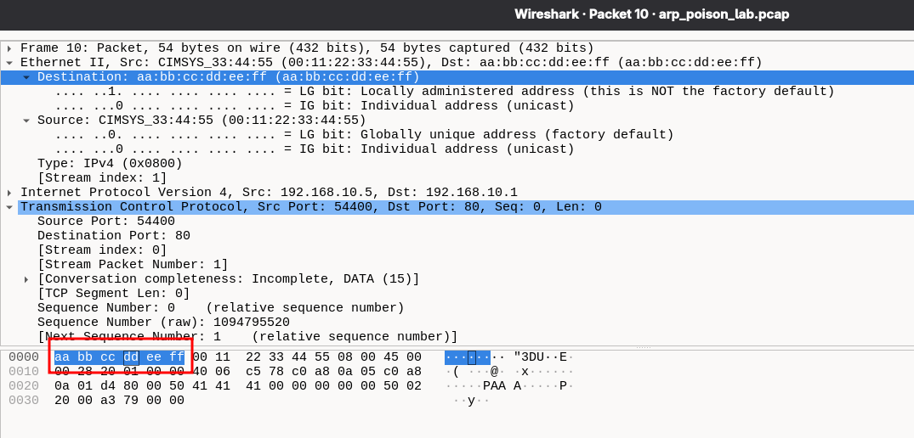

# ARP Cache Poisoning - Wireshark Hands-On Lab

**Capture file:** `arp_poison_lab.pcap`  

---

## Topology

| Role | IP Address | MAC Address | Notes |
|------|-----------|-------------|-------|
| Victim | 192.168.10.5 | 00:11:22:33:44:55 | Client trying to reach the gateway |
| Gateway | 192.168.10.1 | aa:bb:cc:dd:ee:ff | Legitimate default gateway |
| Attacker | 192.168.10.99 | de:ad:be:ef:00:01 | Performs bidirectional ARP poisoning |
| Host A (noise) | 192.168.10.10 | 00:aa:bb:cc:dd:01 | Background DNS / syslog / TLS traffic |
| Host B (noise) | 192.168.10.11 | 00:aa:bb:cc:dd:02 | Background NTP / ICMP traffic |
| Host C (noise) | 192.168.10.20 | 00:aa:bb:cc:dd:03 | Background ARP / ICMP traffic |
| DNS / Syslog | 192.168.10.2 | 00:11:22:33:44:66 | DNS server and syslog collector |
| NTP Server | 192.168.10.3 | 00:11:22:33:44:77 | Network time server |

---

## Part 1 - Overview: What ARP Cache Poisoning Looks Like on the Wire

### Background

ARP (Address Resolution Protocol) maps IP addresses to MAC addresses within a Layer-2 broadcast domain. Every host maintains an ARP cache - a table of IP->MAC bindings that is updated whenever an ARP reply is received, **regardless of whether a request was sent**. This stateless trust model is ARP's central weakness.

An ARP cache poisoning attack exploits this by sending unsolicited (gratuitous) ARP reply frames that contain false IP->MAC mappings. Once the victim's cache is poisoned, frames destined for the gateway's IP will carry the attacker's MAC address in the Ethernet destination field, causing them to be delivered to the attacker's NIC instead of the gateway. When the attack is run bidirectionally - also poisoning the gateway's cache - the attacker sits transparently between the two, able to read or modify all traffic: a classic Man-in-the-Middle (MITM).

The attack has three observable phases in any packet capture: a legitimate ARP baseline, a poisoning phase (gratuitous replies), and post-poison traffic in which the Ethernet destination and IP destination no longer agree.

### Steps

**1.1** Open `arp_poison_lab.pcap` in Wireshark. In the Display Filter bar, enter:
```
arp
```
You should see **20 ARP frames**. Scan the Info column. Notice that most come from recognisable MAC addresses - except for a cluster whose Source is `de:ad:be:ef:00:01`.

**1.2** To isolate only the suspicious ARP frames, apply:
```
arp.src.proto_ipv4 == 192.168.10.1 || arp.src.proto_ipv4 == 192.168.10.5
```
This shows every ARP frame that *claims* to speak for the victim or the gateway. Note which hardware address (field: `arp.src.hw_mac`) appears in the illegitimate entries.

**1.3** Note the three-part structure of the attack:
- **Pre-poison:** Ethernet dst of victim->gateway traffic = `aa:bb:cc:dd:ee:ff` (real MAC).
- **Poison phase:** ARP replies arrive asserting wrong mappings.
- **Post-poison:** Ethernet dst of victim->gateway traffic = `de:ad:be:ef:00:01` (attacker MAC).

---

## Part 2 - The Legitimate ARP Baseline

### Background

Before an ARP cache can be poisoned, it helps to establish what *normal* ARP looks like on this segment. A standard ARP exchange is a request–reply pair. The request is broadcast (Ethernet dst = `ff:ff:ff:ff:ff:ff`), carrying opcode 1 (REQUEST) and a zero target hardware address. The reply is unicast (Ethernet dst = the requester's MAC), carrying opcode 2 (REPLY) with the sender's real hardware address. Both frames carry the same 28-byte ARP payload inside an 0x0806 Ethernet frame.

Crucially, the *sender hardware address* (`arp.src.hw_mac`) in the legitimate reply is the gateway's well-known MAC. Detecting a poisoning attack later amounts to recognising when this binding changes without a corresponding request.

### Steps

**2.1** Apply the filter:
```
arp && frame.number <= 2
```
Select frame 1. In the packet detail pane, expand **Address Resolution Protocol**. Verify:
- `Opcode: request (1)`
- `Sender MAC Address: 00:11:22:33:44:55` (victim)
- `Sender IP Address: 192.168.10.5`
- `Target MAC Address: 00:00:00:00:00:00` (unknown - the whole point of the request)
- `Target IP Address: 192.168.10.1`

**2.2** Select frame 2. Expand ARP. Verify:
- `Opcode: reply (2)`
- `Sender MAC Address: aa:bb:cc:dd:ee:ff` (gateway - **this is the ground truth**)
- `Sender IP Address: 192.168.10.1`
- `Target MAC Address: 00:11:22:33:44:55` (victim)
- `Target IP Address: 192.168.10.5`

**2.3** Apply:
```
arp.opcode == 2 && arp.src.proto_ipv4 == 192.168.10.1
```
At this point only **one** reply claims to be 192.168.10.1. How many replies do you see in the full capture for this IP? (Answer: 6 - 1 legitimate + 5 from the poisoning bursts.) Compare the `arp.src.hw_mac` values between them.

**2.4** Confirm the baseline TCP session used the legitimate gateway MAC. Apply:
```
tcp && ip.dst == 192.168.10.1 && frame.number < 15
```
Select frame 10 (the SYN). In the packet bytes pane, the first 6 bytes are the Ethernet destination. Confirm they read `aa bb cc dd ee ff`.



---

## Part 3 - The Poisoning Phase: Identifying the Spoofed ARP Replies

### Background

ARP poisoning relies on sending opcode-2 (REPLY) frames without a preceding request. These are called *gratuitous ARP replies* and are technically valid per RFC 826, which requires hosts to update their cache upon receiving any ARP reply - solicited or not. The attacker sends them in **bursts** directed at both the victim and the gateway (bidirectional poisoning), and repeats the bursts every few seconds to keep caches poisoned before the OS's natural ARP timeout (typically 60–120 seconds on Linux, 2 minutes on Windows) evicts the false entry.

The tell-tale signature of a spoofed reply is a **MAC address in the sender hardware address field that is inconsistent with the sender IP's true owner** - for example the IP belongs to the gateway but the MAC is the attacker's.

### Steps

**3.1** Apply:
```
arp.opcode == 2 && eth.src == de:ad:be:ef:00:01
```

You should see **10 frames** - two per burst, five bursts. Examine the first pair (t ≈ 2.000 s):
- Frame A: `Sender IP = 192.168.10.1` (gateway's IP), `Sender MAC = de:ad:be:ef:00:01` (attacker's MAC). Ethernet dst = `00:11:22:33:44:55` (victim). This poisons the victim's ARP cache for the gateway entry.
- Frame B: `Sender IP = 192.168.10.5` (victim's IP), `Sender MAC = de:ad:be:ef:00:01`. Ethernet dst = `aa:bb:cc:dd:ee:ff` (gateway). This poisons the gateway's ARP cache for the victim entry.

**3.2** Identify the two poisoning *targets* for each burst:
```
arp.opcode == 2 && eth.src == de:ad:be:ef:00:01 && arp.dst.hw_mac == 00:11:22:33:44:55
```
These are the frames targeting the victim's ARP cache (5 frames).

```
arp.opcode == 2 && eth.src == de:ad:be:ef:00:01 && arp.dst.hw_mac == aa:bb:cc:dd:ee:ff
```
These are the frames targeting the gateway's ARP cache (5 frames).

---

## Part 4 - Traffic Interception: Ethernet vs. IP Destination Divergence

### Background

After the ARP cache is poisoned, the victim's kernel resolves 192.168.10.1 (the gateway) to `de:ad:be:ef:00:01` (the attacker's MAC) because that is what its ARP cache now holds. When it builds the next Ethernet frame, the IP destination remains `192.168.10.1` (correct) but the Ethernet destination is `de:ad:be:ef:00:01` (attacker). This **ETH/IP destination divergence** is the single most reliable low-level indicator of ARP cache poisoning being actively exploited.

Because the attacker is running in forwarding mode (a transparent MITM), they re-emit the frame with corrected Ethernet headers toward the real gateway, so the TCP session does not break. You can observe both the intercepted original and the forwarded copy as consecutive packets with the same IP/TCP contents but different Ethernet src/dst.

### Steps

**4.1** Clear all filters. Locate the post-poison HTTP request (around t = 4.500 s). Apply:
```
http.request && ip.src == 192.168.10.5
```
Select the packet at t ≈ 4.500 s (GET /secret.html). In the packet detail pane:
- Expand **Ethernet II**. Note: `Destination: de:ad:be:ef:00:01` - the *attacker's* MAC.
- Expand **Internet Protocol**. Note: `Destination Address: 192.168.10.1` - the *gateway's* IP.
- These two disagree. This is the divergence.

4.2 The immediately following packet (t ≈ 4.501 s) is the attacker forwarding the same request to the real gateway. Because a transparent MITM re-emits the frame with identical TCP seq/ack/payload, Wireshark tags it [TCP Retransmission] and suppresses HTTP dissection on it - so it will not appear in http.request filters. Use this filter instead to find it:

```
tcp && eth.src == de:ad:be:ef:00:01 && ip.src == 192.168.10.5
```
Select the packet at t ≈ 4.501 s and compare with the original:

- Ethernet II -> Source: **de:ad:be:ef:00:01** (attacker). Destination: **aa:bb:cc:dd:ee:ff** (gateway).

- Internet Protocol: Source: **192.168.10.5** / Destination: **192.168.10.1** - unchanged.

- The TCP seq, ack, and payload are byte-for-byte identical to the original. Only the Ethernet src/dst changed. This is why Wireshark calls it a retransmission - it has no way to know the frame crossed a different NIC. This is also the defining characteristic of a transparent MITM: it is invisible at the IP/TCP layer.

**4.3** Add an `ip.dst` column and an `eth.dst` column to the packet list (right-click column header -> Column Preferences). Sort by `eth.dst`. You will see that all packets from the victim to the gateway IP (`192.168.10.1`) after t = 4 s have Ethernet dst `de:ad:be:ef:00:01`, while those before t = 4 s have `aa:bb:cc:dd:ee:ff`. The column side-by-side view makes this contrast immediately obvious.

**4.4** To specifically query the divergence in a filter:
```
ip.dst == 192.168.10.1 && eth.dst == de:ad:be:ef:00:01
```
Every frame matched by this filter represents intercepted traffic - packets that are logically going to the gateway but physically arriving at the attacker.

---

## Part 5 - The MITM Session: What the Attacker Can See and Modify

### Background

A transparent MITM can do more than read traffic - it can modify in-flight content. In this capture, the attacker intercepts an HTTP response from the gateway and replaces the body before forwarding it to the victim. Because HTTP/1.1 carries a `Content-Length` header, the attacker must ensure the modified body is the same byte length as the original, or also update `Content-Length` - otherwise the TCP stream will desynchronise. In this trace the attacker uses a same-length replacement (`"Confidential Data: OK!"` -> `"Confidential Data: ATK"`, both 22 bytes), keeping the TCP sequence numbers consistent and avoiding detection at the transport layer.

### Steps

**5.1** Apply:
```
http && (ip.src == 192.168.10.5 || ip.src == 192.168.10.1)
```
You will see three HTTP messages: GET /index.html (t≈0.600), 200 "Hello, World!" (t≈0.700), and GET /secret.html (t≈4.500). The attacker's forwarded copies of GET /secret.html and the modified 200 response are tagged [TCP Retransmission] by Wireshark (identical seq/payload, different Ethernet headers) and are suppressed from HTTP dissection - this is expected. To see all six HTTP-level frames including the forwarded and injected copies, use:

```
http || (tcp.analysis.retransmission && eth.src == de:ad:be:ef:00:01)
```

**5.2** Select the HTTP GET at t≈4.500. Expand **Hypertext Transfer Protocol**. Note the `Authorization: Basic` header. Right-click it -> **Copy -> Value**. The base64 string `dXNlcjpwYXNzd29yZA==` decodes to `user:password`. The attacker intercepted cleartext credentials.

**5.3** Select the first 200 response at t≈4.600 (GW->ATK). Expand **Hypertext Transfer Protocol -> HTTP response body** (or look at the **Line-based text data** block). The body reads: `Confidential Data: OK!`.

**5.4** Select the second 200 response at t≈4.601 (ATK->victim). Expand the same field. The body now reads: `Confidential Data: ATK`. This is the injected, modified response. The victim receives a different answer than the gateway sent.

**5.5** Follow the entire TCP stream to see both exchanges in order. Right-click anywhere in the victim's GET /secret.html -> **Follow -> TCP Stream**. The stream view will show both the legitimate GET /index.html exchange (in red = client side, blue = server side) and the second exchange. Confirm the second server response shows the *modified* body because Wireshark assembles the stream from packets with `eth.dst == 00:11:22:33:44:55` (what the victim received).

---

## Part 6 - Detection Indicators

### Background

A passive observer on the same segment - or a network monitoring tool with access to a SPAN/mirror port - can detect ARP cache poisoning without decoding any encrypted payload. The primary indicators are: (1) multiple ARP replies for the same IP with conflicting MAC addresses, (2) a single MAC address claiming to be the hardware address for more than one IP, (3) unsolicited ARP replies (opcode 2 with no preceding opcode 1), and (4) the Ethernet/IP destination divergence described in Part 4. Commercial tools such as ArpWatch, XArp, and Snort's preprocessors all operate on these exact signatures.

### Steps

**6.1** Check for IP-to-MAC conflicts. Apply:
```
arp.opcode == 2 && arp.src.proto_ipv4 == 192.168.10.1
```
Sort by time. The first frame shows `sha = aa:bb:cc:dd:ee:ff`; all subsequent frames for the same IP show `sha = de:ad:be:ef:00:01`. **Any ARP reply where the same IP maps to a different MAC than previously observed is a conflict event.** An IDS/ArpWatch alert would fire at t = 2.000 s.

**6.2** Check whether one MAC claims multiple IPs (MAC-to-IP ambiguity). Apply:
```
arp.opcode == 2 && eth.src == de:ad:be:ef:00:01
```
Expand any two consecutive poison frames. In frame at t≈2.000 s: `spa = 192.168.10.1`. In frame at t≈2.000010 s: `spa = 192.168.10.5`. The same hardware address (`de:ad:be:ef:00:01`) asserts ownership of **two different IP addresses** within 10 ms - a definitive poisoning indicator.

**6.3** Check for unsolicited replies. Apply:
```
arp.opcode == 2
```
For each ARP reply, ask: is there a corresponding request within the immediately preceding frames from the same sender IP? The legitimate reply at t=0.100 was preceded by the request at t=0.000. The attacker's replies have no preceding requests at all - they are gratuitous. Use:
```
arp.opcode == 1 && arp.dst.proto_ipv4 == 192.168.10.1
```
Only **one** request for 192.168.10.1 exists (t=0.000). The 5 replies from the attacker claiming that IP are therefore all unsolicited.

**6.4** Check the red-herring gratuitous ARP (around t=9.120 s). Apply:
```
arp.opcode == 2 && arp.src.proto_ipv4 == 192.168.10.50
```
This single frame - from `00:aa:bb:cc:dd:01` claiming 192.168.10.50 - is a gratuitous announcement for an IP that has no other traffic in the capture. This is noise, not an active attack. Detection tools must distinguish between a new host announcing itself (benign gratuitous ARP) and an attacker repeatedly overwriting an existing binding. **Repetition and binding conflict are the distinguishing features.**

---

## Quick Reference - Wireshark Display Filters

| Goal | Filter |
|------|--------|
| Show all ARP | `arp` |
| Show all non-ARP | `!arp` |
| ARP requests only | `arp.opcode == 1` |
| ARP replies only | `arp.opcode == 2` |
| Attacker ARP frames | `eth.src == de:ad:be:ef:00:01` |
| Attacker poison frames | `arp.opcode == 2 && eth.src == de:ad:be:ef:00:01` |
| MAC/IP conflict: GW_IP | `arp.opcode == 2 && arp.src.proto_ipv4 == 192.168.10.1` |
| MAC/IP conflict: VICTIM_IP | `arp.opcode == 2 && arp.src.proto_ipv4 == 192.168.10.5` |
| ETH/IP dst divergence | `ip.dst == 192.168.10.1 && eth.dst == de:ad:be:ef:00:01` |
| Intercepted data (eth->atk) | `ip.src == 192.168.10.5 && eth.dst == de:ad:be:ef:00:01` |
| Attacker forwarded copies (TCP retrans) | `tcp.analysis.retransmission && eth.src == de:ad:be:ef:00:01` |
| Attacker forwarding to GW | `ip.src == 192.168.10.5 && eth.src == de:ad:be:ef:00:01` |
| Attacker forwarding to victim | `ip.dst == 192.168.10.5 && eth.src == de:ad:be:ef:00:01` |
| Victim HTTP session | `tcp.port == 80 && (ip.src == 192.168.10.5 \|\| ip.dst == 192.168.10.5)` |
| All HTTP in capture | `http` |
| HTTP requests only | `http.request` |
| HTTP responses only | `http.response` |
| Victim TCP stream | `tcp.stream eq 0` |
| DNS traffic | `dns` |
| NTP traffic | `udp.port == 123` |
| Syslog traffic | `udp.port == 514` |
| TLS handshake | `tls.handshake.type == 1` |
| Gratuitous ARP (unsolicited reply) | `arp.opcode == 2 && arp.isgratuitous == 1` |

---

## ARP Cache Poisoning Flow Diagram

```
BEFORE POISONING
═════════════════
 VICTIM                  GATEWAY
 192.168.10.5             192.168.10.1
 00:11:22:33:44:55        aa:bb:cc:dd:ee:ff
      │                        │
      │  ARP REQ (broadcast)   │
      │ ──────────────────────>│  "Who has 192.168.10.1?"
      │                        │
      │  ARP REP (unicast)     │
      │ <──────────────────────│  "I am aa:bb:cc:dd:ee:ff"
      │                        │
      │  Ethernet frame        │
      │  dst: aa:bb:cc:dd:ee:ff│
      │ ──────────────────────>│  Reaches gateway directly
      │                        │


POISONING PHASE
════════════════
 VICTIM          ATTACKER              GATEWAY
                 192.168.10.99
                 de:ad:be:ef:00:01
      │               │                    │
      │  ARP REP ×5   │                    │
      │<──────────────│  "192.168.10.1     │
      │  (every 2s)   │   is at de:ad:be   │
      │               │   :ef:00:01"       │
      │               │                    │
      │               │  ARP REP ×5        │
      │               │───────────────────>│  "192.168.10.5
      │               │  (every 2s)        │   is at de:ad:be
      │               │                    │   :ef:00:01"


AFTER POISONING (MITM)
═══════════════════════
 VICTIM          ATTACKER              GATEWAY
 ARP cache:      (intercepts,          ARP cache:
 GW -> ATK_MAC    reads, modifies,      VICTIM -> ATK_MAC
      │          forwards)                  │
      │                │                   │
      │ Eth dst=ATK    │                   │
      │────────────────>                   │
      │ IP dst=GW_IP   │ Eth dst=GW_MAC    │
      │                │──────────────────>│
      │                │                   │
      │                │   Eth dst=ATK     │
      │                │<──────────────────│
      │ Eth dst=VICTIM │                   │
      │<───────────────│                   │
      │ (MODIFIED)     │                   │


PACKET FIELDS: BEFORE vs AFTER POISONING
══════════════════════════════════════════
 Field              Before              After (victim->GW)
 ──────────────────────────────────────────────────────────
 eth.dst            aa:bb:cc:dd:ee:ff   de:ad:be:ef:00:01  ← CHANGED
 ip.dst             192.168.10.1        192.168.10.1        (same)
 ip.src             192.168.10.5        192.168.10.5        (same)
 tcp.dport          80                  80                  (same)
 tcp.seq            sequential          sequential          (same)
```

---

## Key Protocol Constants

### ARP Opcodes (RFC 826)

| Opcode | Decimal | Meaning |
|--------|---------|---------|
| REQUEST | 1 | Broadcast query: "Who has IP X?" |
| REPLY | 2 | Unicast answer: "IP X is at MAC Y" |


### ARP Frame Field Layout (28 bytes payload)

```
Byte offset  Field                  Value in this capture
──────────────────────────────────────────────────────────
 0– 1        Hardware type          0x0001 (Ethernet)
 2– 3        Protocol type          0x0800 (IPv4)
 4           Hardware addr length   6
 5           Protocol addr length   4
 6– 7        Opcode                 1=REQUEST  2=REPLY
 8–13        Sender hardware addr   (sha) source MAC
14–17        Sender protocol addr   (spa) source IP
18–23        Target hardware addr   (tha) dest MAC (0s in request)
24–27        Target protocol addr   (tpa) dest IP
```

### ARP Cache Timeout Reference

| OS | Default ARP Cache TTL | Reachable entry TTL |
|----|----------------------|---------------------|
| Linux (kernel ≥3.x) | 30 s (stale), 60 s (base reachability) | Up to 70 s with NUD |
| Windows 10/11 | 15–45 s (randomised) | Up to 2 min |
| macOS | 20 min (static), 20 s (dynamic) | Varies |
| Cisco IOS | 4 hours (default) | Configurable |

> **Attacker implication:** A 2-second burst interval provides a >10× safety margin against expiry on all common desktop/server OS configurations

### TCP Flags Bitmask (1-byte flags field)

```
Bit 7  Bit 6  Bit 5  Bit 4  Bit 3  Bit 2  Bit 1  Bit 0
  CWR    ECE    URG    ACK    PSH    RST    SYN    FIN
  0x80   0x40   0x20   0x10   0x08   0x04   0x02   0x01
```
Common combinations used in this capture:

| Hex | Meaning |
|-----|---------|
| 0x02 | SYN |
| 0x12 | SYN+ACK |
| 0x10 | ACK |
| 0x18 | PSH+ACK (data) |
| 0x14 | RST+ACK |

