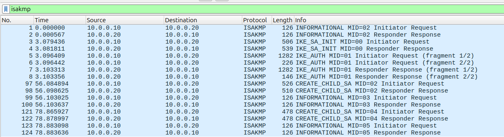
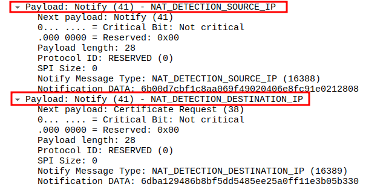
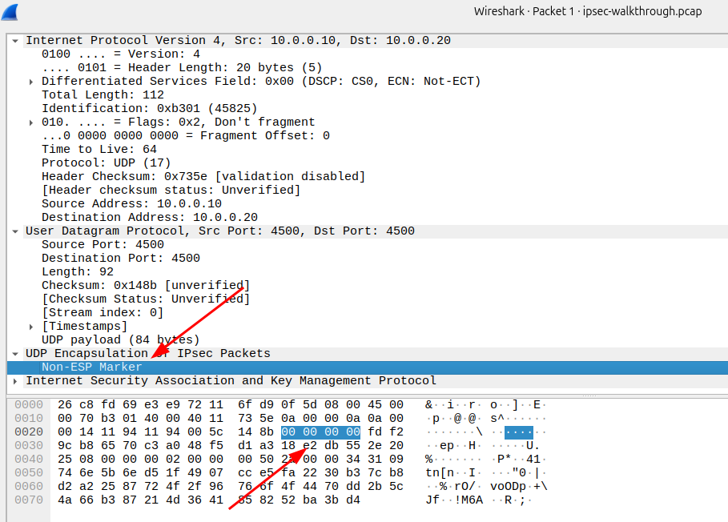
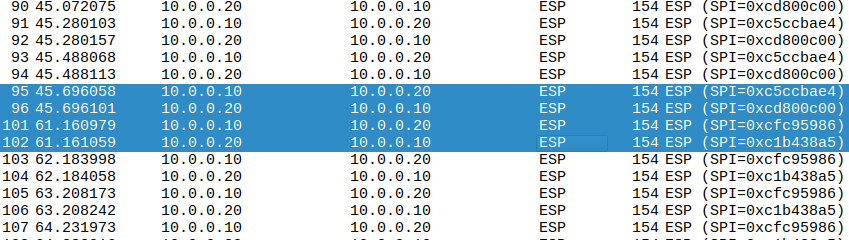

# IPSec & IKEv2
---

## Learning Objectives

By the end of this lab you will be able to:

- Explain the IKEv2 two-phase negotiation process at the packet level
- Identify and interpret `IKE_SA_INIT`, `IKE_AUTH`, `CREATE_CHILD_SA`, and `INFORMATIONAL` exchanges
- Recognise ESP (Encapsulating Security Payload) packets and their structure
- Understand NAT-Traversal (NAT-T) and why IKE migrates from UDP/500 to UDP/4500
- Extract IKE SA parameters from the capture: ciphers, PRF, and DH group
- Track SPI (Security Parameter Index) values across the entire session
- Identify Child SA rekeying events purely from the ESP stream

---

## Lab Topology

```
  INITIATOR                               RESPONDER
  10.0.0.10                               10.0.0.20
  left.lab.local                          right.lab.local
  Inner subnet: 192.168.10.0/24           Inner subnet: 192.168.20.0/24

         |                                      |
         |<======= IKEv2 on UDP/500/4500 ======>|
         |<========= ESP (protocol 50) ========>|
```

| Parameter | Value |
|---|---|
| IKE Version | IKEv2 (RFC 7296) |
| IKE Cipher Suite | AES-256-CBC / HMAC-SHA2-256 / MODP-2048 |
| ESP Cipher | AES-256-GCM-128 |
| Authentication | RSA X.509 Certificates |

---

## Quick Reference: Wireshark Display Filters

Keep this table handy throughout the lab

| Filter | What It Shows |
|---|---|
| `isakmp` | All IKEv2 negotiation packets |
| `esp` | All ESP encrypted data packets |
| `udp.port == 500` | IKE_SA_INIT only |
| `udp.port == 4500` | Post-NAT-T IKE + ESP-in-UDP |
| `isakmp.exchangetype == 34` | IKE_SA_INIT packets only |
| `isakmp.exchangetype == 35` | IKE_AUTH packets only |
| `isakmp.exchangetype == 36` | CREATE_CHILD_SA packets only |
| `isakmp.exchangetype == 37` | INFORMATIONAL packets only |
| `isakmp.flags.initiator == 1` | Only packets sent by the initiator |
| `esp.spi == 0x<value>` | ESP packets matching a specific SPI |
| `isakmp \|\| esp` | All IPSec-related packets at once |

---

# Part 0 - Background: IPSec & IKEv2

Before opening **Wireshark**, let's build the mental model. **IPSec is not a single protocol** - it is a framework of components that work together.

| Component | Protocol | Purpose |
|---|---|---|
| Key Exchange | IKEv2 | Negotiate algorithms, authenticate peers, derive keys |
| Data Encryption | ESP | Encrypt and authenticate data packets |
| Data Auth (legacy) | AH | Authenticate only - no encryption, rarely used today |

### The Two Phases

IKEv2 organises its work into two logical phases:

1. **Phase 1 - IKE SA:** Two mandatory exchanges establish a secure, authenticated control channel between the peers. Everything negotiated after this point is encrypted.

2. **Phase 2 - Child SA:** Using that secure channel, the peers negotiate the actual tunnel parameters (ESP keys, traffic selectors). This is the tunnel that carries your real data.

### The Four IKEv2 Exchange Types

```
Exchange            Port    Purpose
─────────────────────────────────────────────────────────────────
IKE_SA_INIT         500     DH key exchange, algorithm proposals, nonces
IKE_AUTH            4500*   Identity, certificate auth, first Child SA
CREATE_CHILD_SA     4500    Rekey IKE or Child SA, add new Child SAs
INFORMATIONAL       4500    Liveness (DPD), SA deletion, error alerts
```

> \* The move from UDP/500 to UDP/4500 is explained in Part 3 (NAT-Traversal).

---

# Part 1 - Opening the Capture

---

## Step 1.1 - Open the PCAP File

1. Launch Wireshark.
2. Go to **File -> Open** and select `ipsec-walkthrough.pcap`.
3. The packet list loads. You will see a mix of `ISAKMP`, `ESP`, and `UDP` entries.

---

## Step 1.2 - Apply Your First Filter

In the **display filter bar** at the top, type the following and press **Enter**:

```
isakmp
```



You should now see approximately **16 ISAKMP packets**. These are the entire IKEv2 control-plane: the initial negotiation, a rekey, and some liveness checks.

> [!NOTE]
> In Wireshark, `isakmp` is the display filter keyword for **both** IKEv1 and IKEv2. The `Version` field inside each packet tells you which version you are looking at. Every packet in this lab is **IKEv2**.

---

## Step 1.3 - See the Whole Picture

Clear the filter (click the **✕** on the right of the filter bar or press **Ctrl+Z**).

With no filter applied, look at the three protocol types in the list:

| Protocol | What It Is |
|---|---|
| `ISAKMP` | IKEv2 control plane - key exchange and negotiation |
| `ESP` | Encapsulating Security Payload - the encrypted tunnel traffic |
| `UDP` | Outer wrapper used for NAT-Traversal (IKE over UDP/4500) |

Now apply `esp` as a filter. You will see approximately **118 ESP packets** - these are the ping packets that traversed the tunnel, every one fully encrypted. Notice that ESP reveals almost nothing: only the outer IP addresses, the SPI, and a sequence number. The inner payload is completely hidden.

> **Observation:** Even though the payload is encrypted, the packet **sizes** are still visible. Different ping sizes produce different ESP packet lengths. This is called **traffic analysis** - an important limitation of encryption-only approaches.

---

# Part 2 - IKE_SA_INIT: The First Handshake

---

## Background

`IKE_SA_INIT` is always the very first exchange. It travels in **plaintext** over **UDP port 500**. In just two messages, the following is accomplished:

- **SA payload** - the initiator proposes cipher suites; the responder selects one
- **KE payload** - both peers exchange their Diffie-Hellman public values
- **Nonce (Ni/Nr)** - random values used to ensure freshness and prevent replay attacks
- **NAT-D payloads** - hashes used to detect if a NAT device is in the path

After these two messages, both peers independently compute the same shared DH secret. They combine it with the nonces to derive the **IKE SA keys**, which encrypt all subsequent IKEv2 messages.

---

## Step 2.1 - Isolate the IKE_SA_INIT Packets

Apply this filter:

```
isakmp && udp.port == 500
```

You should see **exactly 2 packets**: one from the initiator (`10.0.0.10`) and one from the responder (`10.0.0.20`). Everything from `IKE_AUTH` onwards has moved to UDP/4500.

---

## Step 2.2 - Examine the Initiator's IKE_SA_INIT

Click on the **first packet** (source `10.0.0.10`). In the **packet detail pane** (middle pane), expand `Internet Security Association and Key Management Protocol`.

Work through these fields:

```
Internet Security Association and Key Management Protocol
├── Initiator SPI: <8-byte hex value>       <- Write this down!
├── Responder SPI: 0000000000000000          <- Empty - not yet assigned
├── Next payload: SA (33)
├── Version: 2.0                             <- Confirms IKEv2
├── Exchange type: IKE_SA_INIT (34)
├── Flags: Initiator
├── Message ID: 0                            <- Always 0 for IKE_SA_INIT
│
├── Payload: SA (Security Association)
│   └── Proposal 1
│       ├── Protocol: IKE
│       ├── Transform: ENCR_AES_CBC (keylen=256)
│       ├── Transform: INTEG_HMAC_SHA2_256_128
│       ├── Transform: PRF_HMAC_SHA2_256
│       └── Transform: DH_MODP_2048
│
├── Payload: KE (Key Exchange)
│   ├── DH Group: MODP_2048
│   └── Key Exchange Data: <256 bytes of DH public value>
│
└── Payload: Ni (Nonce)
    └── Nonce: <random bytes>
```

> **Write down the Initiator SPI.** This 8-byte value is the unique identifier for this IKE session. You will see it in every single IKEv2 packet for the lifetime of this SA.

> [!IMPORTANT]
> For this lab it is **e6d252e6ef7b3688**

---

## Step 2.3 - Examine the Responder's Reply

Click on the **second packet** (source `10.0.0.20`). Compare it to the first:

| Field | Initiator Packet | Responder Packet |
|---|---|---|
| Initiator SPI | `e6d252e6ef7b3688` | Same value - must match |
| Responder SPI | `e8702e1d74b29138` | **Now populated** - responder chose its value |
| SA Payload | Multiple proposals | **One proposal** - responder selected |
| KE Payload | Initiator's DH public key | **Responder's DH public key** |
| Nonce | Ni | **Nr** - responder's nonce |

> **Key Concept - SPIs:** The pair of `Initiator SPI + Responder SPI` uniquely identifies this IKE SA. Wireshark shows both in the Info column for easy tracking. IKE SPIs are completely separate from ESP SPIs - they are different numbering spaces.

---

## Step 2.4 - Find the NAT Detection Payloads

Still on the IKE_SA_INIT initiator packet, scroll down through the payload list until you see:

```
Payload: Notify (N) - NAT_DETECTION_SOURCE_IP
Payload: Notify (N) - NAT_DETECTION_DESTINATION_IP
```



These are hashes of `IP + Port`. Both peers send them and compare what they receive against what they expect. If the hashes don't match, a NAT device is rewriting addresses in the path. When NAT is detected, both peers automatically switch all traffic to UDP/4500.

---

# Part 3 - NAT-Traversal: Why Everything Moved to Port 4500

---

## Background

After `IKE_SA_INIT`, every subsequent IKEv2 packet - including ESP data - runs over **UDP/4500**. This is NAT-Traversal (NAT-T), and it happens for two reasons:

1. **NAT breaks ESP.** ESP is IP protocol 50, with no port numbers. A NAT device has no way to track ESP flows or rewrite them correctly. By wrapping ESP inside UDP, NAT devices can track the connection.
2. **NAT breaks IKE integrity.** IKE authentication includes IP address information in its calculations. If a NAT device rewrites the IP, the integrity check fails. Moving to UDP/4500 with a special marker solves this.

---

## Step 3.1 - Confirm the Port Switch

Apply this filter:

```
isakmp && udp.port == 4500
```

All remaining IKEv2 packets live here: `IKE_AUTH`, `CREATE_CHILD_SA`, and `INFORMATIONAL`.

---

## Step 3.2 - Find the Non-ESP Marker

Click on any `ISAKMP` packet on UDP/4500. Switch to the **packet bytes pane** (bottom pane). Look at the very start of the **UDP payload**:

```
00 00 00 00   <- Non-ESP Marker (4 zero bytes)
<IKEv2 header follows>
```



This 4-byte zero prefix tells the receiver: *"This UDP/4500 packet contains an IKEv2 message, not ESP."*

Without this marker, the receiver would see a UDP/4500 packet and try to interpret the payload as an ESP packet - it would look for an SPI in the first 4 bytes and fail.

> [!NOTE]
> In a real enterprise environment you will almost always see IKEv2 on UDP/4500, because most corporate networks use NAT. Pure UDP/500 IKEv2 is only common in data centres with static IP site-to-site tunnels and no NAT in the path.

---

# Part 4 - IKE_AUTH: Authentication and First Tunnel

---

## Background

`IKE_AUTH` is the second mandatory exchange. It is **fully encrypted** - the SK (Encrypted) payload is opaque without the private keys. However, the IKEv2 header and metadata are still visible.

In `IKE_AUTH`, the peers:
- Authenticate each other using RSA certificates
- Exchange identities (`IDi` = `left.lab.local`, `IDr` = `right.lab.local`)
- Create the **first Child SA** (the actual ESP tunnel)
- Exchange **Traffic Selectors** (`TSi`/`TSr`) defining which subnets route through the tunnel

---

## Step 4.1 - Find the IKE_AUTH Packets

Apply the filter:

```
isakmp.exchangetype == 35
```

You should see 2 pairs of packets: one from the initiator and one from the responder.

---

## Step 4.2 - Examine the IKE_AUTH Header

Click on the initiator's `IKE_AUTH` packet. In the detail pane:

```
Internet Security Association and Key Management Protocol
├── Initiator SPI: <same value from Step 2.2>   <- Session continuity
├── Responder SPI: <value from Step 2.3>
├── Exchange type: IKE_AUTH (35)
├── Flags: Initiator,           
├── Message ID: 0x00000001                       <- Always 1 for IKE_AUTH
│
└── Payload: Encrypted and Authenticated (SK)
```

> **What's inside the SK payload (even though we can't see it):**
> - `IDi` - initiator identity: `left.lab.local`
> - `CERT` - the initiator's X.509 certificate
> - `AUTH` - RSA signature over the IKE_SA_INIT data
> - `SAi2` - proposed Child SA parameters (ESP cipher)
> - `TSi / TSr` - traffic selectors: `192.168.10.0/24` and `192.168.20.0/24`

---

## Step 4.3 - Confirm Tunnel Establishment

Remove the exchange type filter and apply:

```
isakmp || esp
```

Sort by time. After the second `IKE_AUTH` packet, you will see the **first ESP packet** appear. That ESP packet is your confirmation that:

1. Both peers authenticated successfully
2. The Child SA was created
3. ESP keys were installed in both directions
4. The tunnel is live

---

# Part 5 - ESP: Analysing the Encrypted Tunnel

---

## Background

ESP (Encapsulating Security Payload, **IP protocol 50**) is the data plane of IPSec. It provides confidentiality, integrity, and replay protection. Despite the encryption, the header fields visible in Wireshark are useful for analysis.

```
 0                   1                   2                   3
 0 1 2 3 4 5 6 7 8 9 0 1 2 3 4 5 6 7 8 9 0 1 2 3 4 5 6 7 8 9 0 1
├───────────────────────────────────────────────────────────────────┤
│                  SPI (Security Parameter Index)   [VISIBLE]       │
├───────────────────────────────────────────────────────────────────┤
│                      Sequence Number              [VISIBLE]       │
├───────────────────────────────────────────────────────────────────┤
│                                                                   │
│            IV + Encrypted Payload (inner IP + data)  [HIDDEN]    │
│                                                                   │
├───────────────────────────────────────────────────────────────────┤
│                Integrity Check Value (ICV)        [VISIBLE]       │
└───────────────────────────────────────────────────────────────────┘
```

---

## Step 5.1 - Examine the First ESP Packet

Apply the filter:

```
esp
```


Click on the **first ESP packet** (source `10.0.0.10`). In the detail pane:

```
Encapsulating Security Payload
├── SPI: 0xc5ccbae4         <- Outbound SPI for left->right direction
├── Sequence number: 1      <- Starts at 1, increments every packet
```


---

## Step 5.2 - Compare the Return Traffic SPI

Click on the **very next packet** (source `10.0.0.20`, same timestamp group). Observe:

```
Encapsulating Security Payload
├── SPI: 0xcd800c00         <- Different SPI - right->left direction
├── Sequence number: 1
```

> **Key Concept - Unidirectional SPIs:** SPIs are **per-direction**. The left->right stream uses one SPI, the right->left stream uses a different SPI. The receiver uses `destination IP + SPI` to look up the correct decryption key. This is why you always see two different SPI values in a bidirectional ESP flow.

---

## Step 5.3 - Track the Sequence Numbers

Scroll through the ESP packets. Notice the sequence numbers incrementing:

```
seq=1, seq=2, seq=3 ... seq=N
```

These exist for **anti-replay protection**. If an attacker captures an ESP packet and retransmits it, the receiver will see a sequence number it has already processed and drop the packet.

> **Foreshadowing:** When a **rekey** occurs (Part 6), you will see the sequence number reset to `1` with a **new SPI**. This SPI change + sequence number reset is how you identify rekeying events purely from the ESP stream, without needing to see the IKEv2 control packets.

---

## Step 5.4 - Observe Payload Size Variation

In the packet list, look at the **Length** column for ESP packets. You will see values like `128`, `192`, `320` bytes. These correspond to different ICMP ping sizes that were sent through the tunnel.

This demonstrates **traffic analysis**: even though the content is encrypted, an observer can still infer:
- **Communication patterns** - who is talking to whom and when
- **Approximate data size** - large vs small transfers
- **Timing patterns** - bursts, pauses, periodic traffic

This is why high-security deployments use **traffic padding** to normalise packet sizes.

---

# Part 6 - CREATE_CHILD_SA: Rekeying the Tunnel

---

## Background

IPSec Security Associations have a finite lifetime (measured in time or bytes transferred). Before expiry, the peers **proactively rekey** by negotiating a new Child SA while the old one is still active, ensuring zero traffic interruption. This is the `CREATE_CHILD_SA` exchange.

`CREATE_CHILD_SA` is also used to rekey the IKE SA itself, and to create additional Child SAs for different traffic flows.

---

## Step 6.1 - Find the Rekey Exchange

Apply the filter:

```
isakmp.exchangetype == 36
```


You should see 2 pair packets (initiator + responder).

---

## Step 6.2 - Examine the CREATE_CHILD_SA Header

Click on the first initiator's `CREATE_CHILD_SA` packet:

```
Internet Security Association and Key Management Protocol
├── Initiator SPI: <same as before - same IKE SA>
├── Exchange type: CREATE_CHILD_SA (36)
├── Message ID: 0x00000002         -       <higher than IKE_AUTH - e.g. 2, 3, or 4>
└── Payload: Encrypted and Authenticated (SK)
    └── <contains new SA proposals + optionally a new KE payload for PFS>
```


> **Note the Message ID.** IKEv2 message IDs increment monotonically within an IKE SA session. The `CREATE_CHILD_SA` carries a higher Message ID than `IKE_AUTH`, confirming it happens later in the same session.

---

## Step 6.3 - Spot the Rekey in the ESP Stream

After the `CREATE_CHILD_SA` exchange completes, switch to the ESP view:

```
esp
```

Find the point in time that corresponds to just after the `CREATE_CHILD_SA` exchange. You should observe:

1. **Old SPI packets** - the last few packets using the original SPI values
2. **New SPI appears** - packets with a completely different SPI value
3. **Sequence number resets to 1** - new SA starts fresh

```
Before rekey:   SPI=0xc5ccbae4, seq=43
Before rekey:   SPI=0xc5ccbae4, seq=44
After rekey:    SPI=0x<new_value>, seq=1     <- New SPI, sequence resets
After rekey:    SPI=0x<new_value>, seq=2
```

- For this lab, it is located here:



> **Perfect Forward Secrecy (PFS):** If the `CREATE_CHILD_SA` encrypted payload contains a `KE` (Key Exchange) payload, the peers performed a new Diffie-Hellman exchange for the rekey. This means the new session keys are mathematically independent of all previous keys - even if a past key is compromised, the new session remains secure.

---

# Part 7 - INFORMATIONAL: Liveness and Housekeeping

---

## Background

The `INFORMATIONAL` exchange is IKEv2's catch-all mechanism. Common uses:

| Use Case | Description |
|---|---|
| **Dead Peer Detection (DPD)** | An empty request/response pair to check if the remote peer is still reachable |
| **Delete SA** | Notify the peer that a specific IKE or Child SA is being torn down cleanly |
| **Error Notifications** | Alert the peer about auth failures, unsupported algorithms, etc. |

---

## Step 7.1 - Find INFORMATIONAL Exchanges

Apply the filter:

```
isakmp.exchangetype == 37
```


You should see at least 2 packets (a request/response pair). In this capture, INFORMATIONAL exchanges appear at the start (from the previous session teardown) and after the rekey.

---

## Step 7.2 - Examine an INFORMATIONAL Packet

Click on an INFORMATIONAL packet. Note:

```
Internet Security Association and Key Management Protocol
├── Exchange type: INFORMATIONAL (37)
├── Flags: Initiator
├── Message ID: <incrementing value>
└── Payload: Encrypted and Authenticated (SK)
    └── <may be empty for DPD, or contain Delete/Notify payloads>
```

> **Even empty DPD messages are encrypted.** The SK payload exists even when logically empty. IKEv2 always encrypts and integrity-protects its payloads once the IKE SA is established.

---

## Step 7.3 - Understand DPD Timing

Dead Peer Detection works like this:

```
1. No IKE or ESP traffic observed for N seconds
         v
2. Peer A sends empty INFORMATIONAL request
         v
3. If alive, Peer B responds with empty INFORMATIONAL response
         v
4. If no response after retries -> tunnel declared dead -> teardown begins
```

In Wireshark, a DPD exchange looks like **two very small, closely-timed ISAKMP packets** - you can spot them by the short time delta between them compared to the surrounding ESP traffic.

---

# Part 8 - Putting It All Together: The Full Packet Flow

Here is the complete sequence of what you just analysed, mapped to the capture:

```
  INITIATOR (10.0.0.10)                           RESPONDER (10.0.0.20)
       │                                                   │
       │── IKE_SA_INIT [I] ──────────── UDP/500 ─────────>│
       │   SA proposals, KE, Ni, NAT-D payloads            │
       │                                                   │
       │<─ IKE_SA_INIT [R] ──────────── UDP/500 ──────────│
       │   Selected SA, KE, Nr, NAT-D payloads             │
       │                                                   │
       │     ┌─ NAT detected ─ switching to UDP/4500 ─┐   │
       │                                                   │
       │── IKE_AUTH [I] ─────────── UDP/4500 (enc) ──────>│
       │   {IDi, CERT, AUTH, SAi2, TSi, TSr}               │
       │                                                   │
       │<─ IKE_AUTH [R] ─────────── UDP/4500 (enc) ───────│
       │   {IDr, CERT, AUTH, SAr2, TSi, TSr}               │
       │                                                   │
       │     ┌─── IKE SA ESTABLISHED ───────────────────┐ │
       │     └─── Child SA (ESP) INSTALLED ─────────────┘ │
       │                                                   │
       │══ ESP (SPI=0xc5..., seq=1) ════════════════════>══│  <- Encrypted ping
       │<═ ESP (SPI=0xcd..., seq=1) ════════════════════════│  <- Encrypted reply
       │══ ESP (SPI=0xc5..., seq=2..N) ═════════════════>══│
       │                                                   │
       │── INFORMATIONAL [I] ───── UDP/4500 (enc) ────────>│  <- DPD check
       │<─ INFORMATIONAL [R] ───── UDP/4500 (enc) ─────────│
       │                                                   │
       │── CREATE_CHILD_SA [I] ─── UDP/4500 (enc) ────────>│  <- Rekey
       │<─ CREATE_CHILD_SA [R] ─── UDP/4500 (enc) ─────────│
       │                                                   │
       │     ┌─── New Child SA INSTALLED ───────────────┐  │
       │     └─── Old Child SA DELETED ─────────────────┘  │
       │                                                   │
       │══ ESP (NEW SPI, seq=1) ═════════════════════════>══│  <- Rekeyed traffic
       │<═ ESP (NEW SPI, seq=1) ══════════════════════════>══│
       │                                                   │
```
