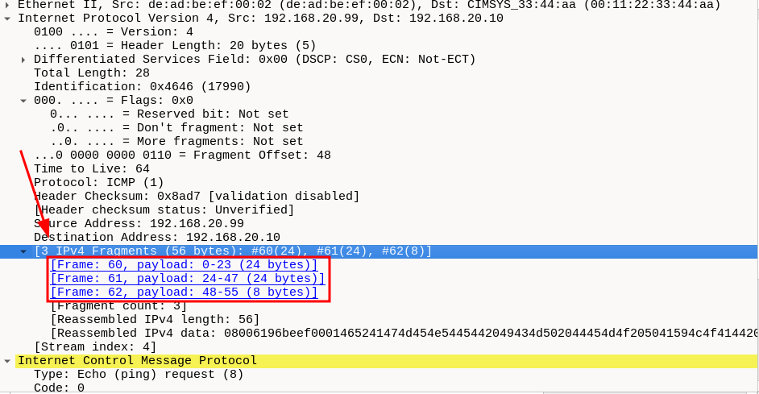

# IP Packet Fragmentation via Fragroute - Hands-On Lab

**Capture file:** `fragroute_lab.pcap`  

---

## Topology

| Role | IP Address | MAC Address | Notes |
|------|-----------|-------------|-------|
| Victim / IDS | 192.168.20.10 | 00:11:22:33:44:AA | Runs a shallow-inspection IDS/firewall |
| Gateway | 192.168.20.1 | AA:BB:CC:DD:EE:01 | Default router |
| Attacker | 192.168.20.99 | DE:AD:BE:EF:00:02 | Runs Fragroute |
| Noise host 1 | 192.168.20.50 | 00:50:56:01:02:03 | Background workstation |
| Noise host 2 | 192.168.20.55 | 00:50:56:04:05:06 | Background workstation |

---

## Part 1 - Overview

### Background

IP fragmentation is a legitimate mechanism defined in RFC 791 that allows a router to split an IPv4 datagram that is too large for the next-hop MTU into smaller fragments. Each fragment is an independent, valid IP datagram carrying a slice of the original payload. Fragmentation is controlled by three fields in the IPv4 header: the **Identification** field (16 bits, shared across all fragments of one datagram), the **Flags** field (3 bits: Reserved, DF, MF), and the **Fragment Offset** field (13 bits, in units of 8 bytes). The receiving host's IP stack silently reassembles the fragments before handing the datagram to the transport layer.

Fragroute is a network tool that intercepts outgoing packets and re-fragments them according to a configurable ruleset, introducing techniques such as tiny fragments, overlapping fragments, out-of-order delivery, and duplicate fragments with conflicting payloads. The goal is to exploit the mismatch between how an in-path IDS/firewall reassembles fragments (or fails to) and how the target operating system reassembles them.

### Steps

1. Open `fragroute_lab.pcap` in Wireshark. 

Apply the display filter `ip` to see only IPv4 packets (hides ARP). Observe the **Info** column - entries labelled *IP Fragment* are mixed in with normal protocol traffic.

2. To isolate all fragmented IP datagrams, apply:

```
ip.flags.mf == 1 or ip.frag_offset > 0
```

Confirm the **Source** column shows only `192.168.20.99` (the attacker) for the attack fragments

3. Note the five distinct IP Identification values used in the attack: `0x4141`, `0x4242`, `0x4343`, `0x4444`, `0x4545` (TCP), and `0x4646` (ICMP). These values are unnaturally sequential - a real detection indicator.

4. Apply :

```
ip and not (ip.flags.mf == 1) and not (ip.frag_offset > 0)
```

Read the count in the **Status Bar**. You should see **79** unfragmented IPv4 packets - the legitimate background traffic a passive observer would also see

---

## Part 2 - The Legitimate Baseline

### Background

Before launching Fragroute the attacker conducted a normal, unfragmented HTTP transaction with the victim. This establishes a baseline of what normal traffic looks like and validates that the victim's port 80 is reachable without IDS interference. The session uses TCP ports 54321 -> 80, with attacker ISN `0xDEAD0001` and victim ISN `0xCAFE0001`. All datagrams in this phase have the DF (Don't Fragment) bit set - a normal characteristic of modern TCP stacks using Path MTU Discovery.

### Steps

1. To isolate the legitimate session, apply:

```
tcp.port == 54321
```

You should see a complete 10-packet exchange: **SYN** -> **SYN-ACK** -> **ACK** -> **GET** -> **ACK** -> **200 OK** -> **ACK** -> **FIN-ACK** -> **FIN-ACK** -> **ACK**

2. Click the SYN packet. Expand **Internet Protocol Version 4** in the packet detail tree. Note:
   - **Flags: 0x2** - only the DF bit is set; MF=0 and fragment offset=0.
   - **Identification** - every packet in this stream has a unique, incrementing IP ID.

3. Click the HTTP GET packet. Expand **Transmission Control Protocol**. Verify:
   - **Sequence Number (raw):** `0xDEAD0002` (ISN + 1, after SYN consumed one sequence number).
   - **Next Sequence Number** advances by exactly 58 bytes (the length of the GET request).

4. Right-click the SYN packet -> **Follow -> TCP Stream**. Confirm the stream shows the full HTTP request and `Hello, World!` response with no missing segments or reassembly gaps.

5. Compare **Total Length** values across all packets in this stream. Each reflects that packet's full payload - no 8-byte anomalies, no fragmentation noise.

---

## Part 3 - The Fragmentation Phase

### Background

When Fragroute fragments a datagram, each IP fragment is a standalone valid IP datagram. The original payload is split into chunks, each assigned a **fragment offset** (byte position / 8) and the **MF (More Fragments)** flag. Every fragment except the last has MF=1; the last has MF=0. All non-final fragments must have a data payload whose size is a multiple of 8 bytes (RFC 791 §3.1). The receiving IP stack holds fragments in a reassembly buffer keyed by `{src_ip, dst_ip, protocol, IP_ID}` until the final fragment (MF=0) arrives and all offset gaps are filled

Fragroute demonstrates this most clearly with the **fragmented ICMP** echo request (IP ID `0x4646`): a 56-byte ICMP message split into three fragments of 24 + 24 + 8 bytes

### Steps

1. To isolate the three ICMP fragments, apply: 
```
ip.id == 0x4646
```

2. Click the first fragment. In **Internet Protocol Version 4** expand **Flags**:
   - **More Fragments: Set** (MF bit = 1)
   - **Fragment Offset: 0** - this is the first piece, starting at byte 0
   - **Total Length: 44** = 20 (IP header) + 24 (this fragment's data)

3. Click the second fragment. Verify:
   - **Fragment Offset: 3** -> 3 × 8 = **24 bytes** into the original payload
   - **Total Length: 44** = 20 + 24
   - **More Fragments: Set**

4. Click the third (final) fragment. Verify:
   - **Fragment Offset: 6** -> 6 × 8 = **48 bytes** into the original payload
   - **Total Length: 28** = 20 + 8
   - **More Fragments: Not Set** - MF=0 terminates the chain

5. **Offset math verification:** Last byte = (6 × 8) + 8 − 1 = **55**, covering bytes 0–55 = 56 bytes total

6. Wireshark reassembles the fragments automatically. Click the *third* fragment and look at the bottom of the packet tree for **3 IPv4 Fragments**:



---

## Part 4 - Fragroute Evasion Techniques

### Background

Fragroute implements four classic evasion primitives that exploit edge cases in IP reassembly:

**Tiny Fragment Attack (RFC 1858):** The first fragment is deliberately made as small as possible - 8 bytes, the minimum imposed by the offset field's 8-byte granularity. An 8-byte first fragment of a TCP segment carries only `src_port (2) + dst_port (2) + sequence_number (4)`. TCP flags, acknowledgment number, window size, and checksum all land in the second fragment. A stateless IDS inspecting only the first fragment cannot determine whether the segment is a SYN, carries a dangerous payload, or is even a complete connection attempt.

**Overlapping Fragments:** Two fragments are sent covering the same byte range but with different content. The first (decoy) carries benign-looking data that satisfies the IDS signature. The second (attack) overlaps part of the first and carries the real payload. On Linux and BSD systems, IP reassembly uses **last-writer-wins**: when two fragments claim the same bytes, the later-arriving data overwrites the earlier. An IDS using first-writer-wins will see the decoy; the victim OS using last-writer-wins will execute the attack.

**Out-of-Order Delivery:** Fragroute delivers the fragment with the highest offset first and the fragment with offset=0 last. This forces the reassembly buffer to hold incomplete state longer, can trigger timeout paths in low-memory IDS devices, and exploits implementations that only inspect the first-arriving fragment.

**Fragment Storm / Duplicate MF Chain:** Multiple fragments are sent for a single IP ID in rapid succession, including a duplicate with conflicting content. This pressures the reassembly buffer, may evict earlier correct fragments, and causes incorrect reassembly depending on the order duplicates are processed.

### Steps

**Tiny Fragment Attack (IP ID 0x4141)**

1. Apply:

```
ip.id == 0x4141
```

You will see **two rows**: the first IP fragment (Protocol = IPv4, labelled *Fragmented IP protocol*) and Wireshark's reassembled TCP SYN row (Protocol = TCP) derived from the second fragment. Wireshark automatically merges the two raw fragments and presents the last fragment's frame as the reassembled packet - so both fragments are accounted for in just two display rows. The **RST|ACK** reply from the victim carries a *different* IP ID (assigned by the victim's own IP stack) and will **not** appear under this filter; use the separate filter in step 4 to find it.

2. Click the first row **(Protocol = IPv4, Fragmented IP protocol)**. There is no TCP layer - Wireshark cannot decode transport headers from an 8-byte fragment alone. Expand Data instead and observe the 8 raw bytes: src_port (2 B) + dst_port (2 B) + sequence_number (4 B). This is all a stateless IDS can see from this fragment - TCP flags, window size, and checksum are entirely absent.

3. Click the second row (Protocol = TCP, *[SYN]*). This is the reassembled view. Expand **Internet Protocol Version 4**:
   - **Fragment Offset: 1** -> byte 8. This fragment contributed the rest of the TCP header
   - Expand **Transmission Control Protocol**: the full SYN flags are now visible, including `Flags: 0x002 (SYN)`

4. To find the **RST|ACK** reply from the victim, apply:
```
tcp.flags == 0x014 and ip.src == 192.168.20.10 and tcp.dstport == 44444
```

Click it and verify **Acknowledgment Number (raw): 0xDEAD1235** = TINY_ISN + 1 = 3,735,344,692 + 1

**Overlapping Fragments (IP ID 0x4242)**

5. Apply:

```
ip.id == 0x4242
```

Two fragments appear

6. Click Frag A (offset=0, len=16). The IP payload reads `GET / HTTP/1.1\r\n` - benign HTTP. This is what a first-writer-wins IDS reassembles

7. Click Frag B (offset=1 = byte 8, len=32). Payload: `EXPLOIT_PAYLOAD!Host: evil.com\r\n`. Bytes 0–7 of this fragment overwrite bytes 8–15 of Frag A on last-writer-wins systems.

8. **Manual reassembly (last-writer-wins):** Frag A contributes bytes 0–7: `GET / HT`. Frag B contributes bytes 8–39: `EXPLOIT_PAYLOAD!Host: evil.com\r\n`. Combined: `GET / HTEXPLOIT_PAYLOAD!Host: evil.com\r\n`.

**Out-of-Order Delivery (IP ID 0x4343)**

9. Apply:

```
ip.id == 0x4343
```

Observe the **Time** column: the packet with **Fragment Offset: 2** (byte 16) has an *earlier* timestamp than the packet with **Fragment Offset: 0**

10. Verify: offset=2 fragment -> MF=0 (final), data = `world!\r\n` + padding. offset=0 fragment -> MF=1, data = `Hello, frag data`. The receiver cannot begin reassembly until offset=0 arrives, so it must buffer the high-offset fragment while waiting.

**Fragment Storm / Duplicate MF Chain (IP ID 0x4444)**

11. Apply:

```
ip.id == 0x4444
```

Count rows: **7 packets** - 6 ordered fragments (offsets 0–5) plus one duplicate at offset=2 with payload `CONFLICT` (which differs from the original offset=2 data `CHUNK_03`).

12. Sort by **Time** and confirm all 7 arrive within about 6 ms - a burst rate that is a strong detection indicator.

---

## Part 5 - IDS/Firewall Evasion Mechanics

### Background

Shallow-inspection firewalls and stateless IDS signatures operate on individual packets, not on reassembled datagrams. When a TCP segment is fragmented, the transport-layer header fields - TCP flags, destination port, and application payload - are spread across multiple IP fragments. A stateless firewall applying a rule like "block TCP SYN to port 80" cannot match that rule against Frag 1 of IP ID 0x4141 because the flags byte has not yet arrived. The firewall either passes the fragment silently (evasion succeeds) or drops all fragments blindly (breaking legitimate fragmented traffic, a self-inflicted DoS risk).

The hidden HTTP payload attack (IP ID 0x4545) is the most complete demonstration: the fully reassembled TCP segment contains `GET /cmd.php?exec=cat%20/etc/passwd HTTP/1.1` - a string that would immediately match a command-injection IDS signature if sent unfragmented. By splitting the TCP segment at byte offset 24 (just past the TCP header and four bytes of the URL), neither fragment individually triggers the signature.

### Steps

1. To isolate the hidden-payload attack, apply:

```
ip.id == 0x4545
```

You will see two rows:

- **Row 1** (Protocol = IPv4): the raw first fragment - `off=0, ID=4545, [Reassembled in #59]`


- **Row 2** (Protocol = HTTP): Wireshark's fully reassembled view, Info column already shows `GET /cmd.php?exec=cat%20/etc/passwd HTTP/1.1`


2. Click **Row 1** (the raw IPv4 fragment). In **Internet Protocol Version 4** note:

- **Total Length: 44** = 20 (IP header) + 24 (this fragment's data)

- **More Fragments: Set, Fragment Offset: 0**

- **Expand Data** - 24 raw bytes: the 20-byte TCP header plus the first 4 bytes of the HTTP request (GET ). No IDS string-match on cat%20/etc/passwd can fire against this fragment alone.


3. Click **Row 2** (the HTTP row, frame 59). This is the reassembled view. In **Internet Protocol Version 4** note:

- **Fragment Offset: 3** -> byte 24 - this is the second raw fragment contributing its 92-byte payload

- At the bottom of the packet tree Wireshark shows **IPv4 fragments** listing both contributing frames

- Expand **Hypertext Transfer Protocol** - the full decoded HTTP GET is visible including `Request URI: /cmd.php?exec=cat%20/etc/passwd`. This is what a deep-inspection engine performing reassembly would catch.


4. To confirm what a stateless IDS cannot see: apply

```
ip and not (ip.flags.mf == 1) and not (ip.frag_offset > 0) and ip.src == 192.168.20.99
```

The HTTP GET to `/cmd.php` is entirely absent from this view. Only the legitimate unfragmented GET from Section 2 appears - the malicious request is invisible to any sensor that does not perform reassembly.

5. To simulate a deep-inspection engine: apply:

```
ip.id == 0x4545
```

Examine the reassembled frame. The strings `cmd.php` and `etc/passwd` are now visible in the bytes pane - a modern IPS with reassembly capability would catch this

---

## Quick Reference Filter Table

| Goal | Wireshark Display Filter |
|------|--------------------------|
| All fragmented packets | `ip.flags.mf == 1 or ip.frag_offset > 0` |
| Non-final fragments only (MF=1) | `ip.flags.mf == 1` |
| First fragment of a chain | `ip.frag_offset == 0 and ip.flags.mf == 1` |
| Final fragment only | `ip.frag_offset > 0 and ip.flags.mf == 0` |
| All unfragmented IPv4 (noise baseline) | `ip and not ip.flags.mf == 1 and not (ip.frag_offset > 0)` |
| Tiny fragment attack | `ip.id == 0x4141` |
| Overlapping fragment attack | `ip.id == 0x4242` |
| Out-of-order delivery attack | `ip.id == 0x4343` |
| Fragment storm | `ip.id == 0x4444` |
| Hidden HTTP payload | `ip.id == 0x4545` |
| Fragmented ICMP | `ip.id == 0x4646` |
| All attack fragments from attacker | `ip.src == 192.168.20.99 and (ip.flags.mf == 1 or ip.frag_offset > 0)` |
| Attacker's unfragmented traffic only | `ip.src == 192.168.20.99 and not ip.flags.mf == 1 and not (ip.frag_offset > 0)` |
| Legitimate TCP baseline session | `tcp.port == 54321` |
| Fragment overlap expert warning | Apply `ip.id == 0x4242` then Analyze -> Expert Information |
| Reassembled payload view | Click last fragment of any chain -> Reassembled IPv4 in packet tree |
| Storm burst in I/O graph | Statistics -> I/O Graph -> filter `ip.id == 0x4444`, 10ms interval |

---

## IP Fragmentation Flow Diagram (ASCII)

```
ATTACKER (192.168.20.99)                         VICTIM (192.168.20.10)
─────────────────────────────────────────────────────────────────────────

Original datagram - 56-byte ICMP, IP ID 0x4646
┌──────────────────────────────────────────────────────────────┐
│ IP header (20 B) │ ICMP header (8 B) │   ICMP Data (48 B)    │
└──────────────────────────────────────────────────────────────┘
                   <──────────── 56 B IP payload ─────────────>

Fragroute splits into 3 fragments:

Fragment 1              Fragment 2              Fragment 3
offset=0 (byte 0)       offset=3 (byte 24)      offset=6 (byte 48)
MF=1                    MF=1                    MF=0
TotalLen=44             TotalLen=44             TotalLen=28
┌──────────────┐        ┌──────────────┐        ┌──────────┐
│IP│bytes 0-23 │───────>│IP│bytes 24-47│───────>│IP│48-55  │
└──────────────┘        └──────────────┘        └──────────┘

             v arrive at victim (in wire order) v

REASSEMBLY BUFFER  keyed on {src=.99, dst=.10, proto=1, ID=0x4646}
╔══════════════════════════════════════════════════════════╗
║  bytes  0-23  (from Frag 1)                             ║
║  bytes 24-47  (from Frag 2)                             ║
║  bytes 48-55  (from Frag 3)  <- MF=0 triggers deliver   ║
╚══════════════════════════════════════════════════════════╝
All gaps filled + MF=0 seen -> deliver complete 56-byte ICMP to IP layer

OFFSET MATH:
  fragment_offset_field × 8 = byte position in original IP payload
  Frag 1:  0 × 8 =  0  start byte
  Frag 2:  3 × 8 = 24  start byte
  Frag 3:  6 × 8 = 48  start byte
  End:     48 + 8 − 1 = 55  ->  56 bytes total

─────────────────────────────────────────────────────────────────────────

TINY FRAGMENT ATTACK - IP ID 0x4141

Full TCP SYN header (20 bytes):
┌──────┬──────┬──────────┬──────────┬──────┬──────┬───────┬──────┐
│sport │dport │  seq(4B) │  ack(4B) │doff/F│  win │  csum │  urg │
│  2B  │  2B  │          │          │  2B  │  2B  │  2B   │  2B  │
└──────┴──────┴──────────┴──────────┴──────┴──────┴───────┴──────┘
<──────── Frag 1 (8 bytes, MF=1, offset=0) ───────>
                          <──── Frag 2 (12 bytes, MF=0, offset=1=8B) ────>

IDS inspects Frag 1 only -> TCP flags field is in Frag 2 -> IDS cannot see SYN bit

─────────────────────────────────────────────────────────────────────────

OVERLAPPING FRAGMENTS - IP ID 0x4242   (last-writer-wins on Linux/BSD)

Frag A  offset=0  len=16  MF=1   <- decoy, IDS sees this
┌──────────────────────────────────┐
│ GET / HTTP/1.1\r\n               │  bytes 0-15
└──────────────────────────────────┘

Frag B  offset=1 (=byte 8)  len=32  MF=0   <- attack, overwrites bytes 8-15
        ┌────────────────────────────────────────────────────────────┐
        │ EXPLOIT_PAYLOAD!Host: evil.com\r\n                         │ bytes 8-39
        └────────────────────────────────────────────────────────────┘

IDS (first-writer-wins):   bytes 0-15 = "GET / HTTP/1.1\r\n"   <- passes rule
Victim OS (last-writer):   bytes  0-7 = "GET / HT"
                           bytes 8-39 = "EXPLOIT_PAYLOAD!Host: evil.com\r\n"

─────────────────────────────────────────────────────────────────────────

OUT-OF-ORDER DELIVERY - IP ID 0x4343

Wire order:    [offset=2, MF=0] arrives FIRST  <- higher offset
               [offset=0, MF=1] arrives SECOND <- lower offset

Reassembly:    buffer holds offset=2 chunk, waits for offset=0
               offset=0 arrives -> gaps filled -> deliver
               Correct payload: "Hello, frag data" + "world!\r\n..."
```
