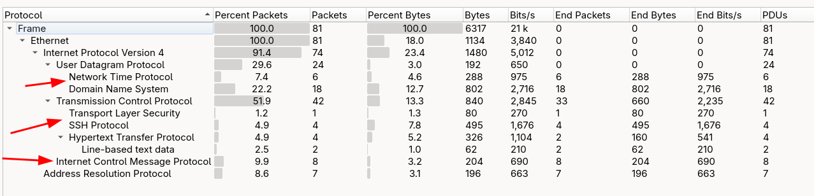
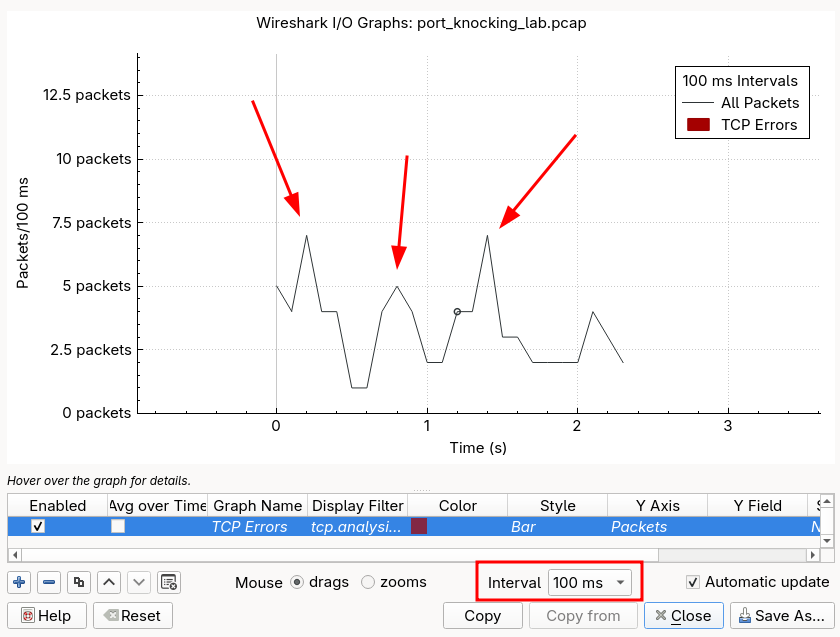
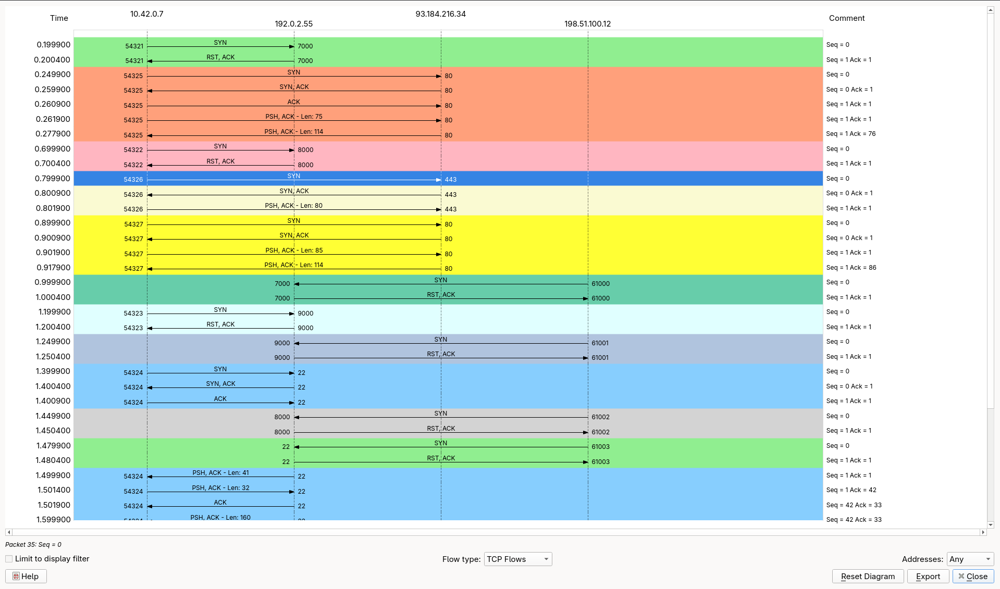

# Port Knocking on the Wire

**Capture file:** `port_knocking_lab.pcap`  


---

## Topology

| Role | IP Address | MAC Address | Notes |
|---|---|---|---|
| Knocking client (valid) | 10.42.0.7 | 00:11:22:33:44:55 | Completes correct sequence |
| Protected server | 192.0.2.55 | aa:bb:cc:dd:ee:ff | Runs knockd; SSH on port 22 |
| Failing attacker | 198.51.100.12 | 00:de:ad:be:ef:01 | Wrong knock order |
| Default gateway | 10.42.0.1 | 00:00:5e:00:01:01 | Also does ARP / NTP forwarding |
| DNS resolver | 8.8.8.8 | - | Google Public DNS |
| NTP server | 216.239.35.4 | - | time.google.com |
| Web server (noise) | 93.184.216.34 | - | example.com |

---

## Session Timeline

| Time (rel.) | Event | Src IP | Dst IP | Dst Port |
|---|---|---|---|---|
| 0.000 s | ARP: client resolves server | 10.42.0.7 | 192.0.2.55 | - |
| 0.050–0.162 s | DNS + ICMP noise (pre-knock) | 10.42.0.7 | various | 53 / ICMP |
| **0.200 s** | **Knock 1** | **10.42.0.7** | **192.0.2.55** | **7000** |
| 0.250–0.512 s | HTTP, NTP, DNS noise | 10.42.0.7 | various | 80, 123, 53 |
| **0.700 s** | **Knock 2** | **10.42.0.7** | **192.0.2.55** | **8000** |
| 0.750–0.918 s | ICMP, TLS, HTTP noise | 10.42.0.7 | various | various |
| 1.000 s | Attacker knock 1 (port 7000) | 198.51.100.12 | 192.0.2.55 | 7000 |
| **1.200 s** | **Knock 3** | **10.42.0.7** | **192.0.2.55** | **9000** |
| 1.250 s | Attacker knock 2 - **WRONG PORT** (9000) | 198.51.100.12 | 192.0.2.55 | 9000 |
| **1.400 s** | **SSH SYN - port 22 now open** | **10.42.0.7** | **192.0.2.55** | **22** |
| 1.450 s | Attacker knock 3 (8000) - too late / wrong order | 198.51.100.12 | 192.0.2.55 | 8000 |
| 1.480 s | Attacker tries SSH -> RST | 198.51.100.12 | 192.0.2.55 | 22 |
| 1.500–1.601 s | SSH banner + KEX INIT exchange | 10.42.0.7 <--> 192.0.2.55 | - | 22 |
| 1.800–2.050 s | SSH encrypted data | 10.42.0.7 <--> 192.0.2.55 | - | 22 |
| 2.200 s | SSH session teardown (FIN/ACK) | 10.42.0.7 | 192.0.2.55 | 22 |

---

## Part 1 - Overview: What Port Knocking Looks Like on the Wire

### Background

Port knocking is a method of externally opening a firewall port by sending connection attempts (knocks) to a pre-defined sequence of closed ports in the correct order. The firewall watches all traffic passively; no daemon listens on the knock ports. When it sees the correct sequence from a single IP, it temporarily opens the protected port for that source IP only.

From a packet-capture perspective, port knocking is intentionally designed to look like *noise* - a series of unremarkable, dropped connection attempts scattered among other traffic. A passive observer with no prior knowledge of the sequence cannot distinguish a knock from ordinary connection probing, which is precisely the security model.

In this capture you will see 81 packets spanning ~2.4 seconds. Six of those packets are the knock SYN packets. They are surrounded by ARP, DNS, HTTP, NTP, ICMP, and TLS traffic so that no single column sort immediately reveals the sequence.

### Steps

1. Open `port_knocking_lab.pcap` in Wireshark. Verify the capture has **81 packets** spanning **2.362 seconds** (`Statistics -> Capture File Properties`).

2. Get a high-level count of each protocol in play:

In `Statistics -> Protocol Hierarchy` note the split between TCP, UDP, ICMP, and ARP at the top level.




3. Use the **I/O Graph** (`Statistics -> I/O Graph`) to observe the packet rate over time, make sure you select the **Interval** to be **100ms**!!! You should see small bursts at t≈0.2, t≈0.8, and t≈1.4 seconds - each corresponding to a knock - and a larger sustained cluster between t≈1.4–2.2 seconds for the SSH session.



4. Apply this filter to see only the traffic sent to the server `192.0.2.55`:

```
ip.dst == 192.0.2.55
```

You should see 16 packets destined for the server: 2 ICMP pings, 3 valid knock SYNs from 10.42.0.7, 4 packets from the failing attacker (198.51.100.12) - 3 knock SYNs and a rejected SSH SYN - and 7 SSH packets covering the 3-way handshake, client banner, encrypted data, and FIN/ACK teardown.

5. Note the **mix of protocols**. Before applying any context, the knock packets (packets 9, 26, 43) are indistinguishable from background scanning noise. This is port knocking's first line of defence.

---

## Part 2 - The Knock Sequence: Identifying the Sequence Ports

### Background

The client `10.42.0.7` sends three TCP SYN packets to ports **7000**, **8000**, and **9000** in that order, each approximately 500 ms apart. The server's firewall `RST|ACK`s each one - confirming the port is closed, but internally recording the knock. Only after all three arrive in the correct order does the firewall transition state and open port 22 for that source IP.

The knock packets have no payload. They are bare SYN segments. Wireshark will show them as `[SYN]` in the Info column. The RST replies are immediate - typically under 1 ms - because no application is listening; the kernel's TCP stack handles the RST without involving any daemon.

### Steps

1. Isolate all TCP SYN packets (no SYN-ACK) from the client:

```
ip.src == 10.42.0.7 && tcp.flags.syn == 1 && tcp.flags.ack == 0
```

You should see **8 packets**. Four of them are noise - HTTP connections to 93.184.216.34 on ports 80 and 443 - which illustrates exactly why bare SYNs alone are not enough to identify a knock. The three knock SYNs (packets 9, 26, 43) are only distinguishable because their destination is 192.0.2.55 and they are immediately RST'd with no handshake progression. Packet 51 is the SSH SYN after the gate opens.

2. To see only the knock SYNs (excluding the SSH connection), filter by the three knock ports:

```
ip.src == 10.42.0.7 && tcp.flags.syn == 1 && (tcp.dstport == 7000 || tcp.dstport == 8000 || tcp.dstport == 9000)
```

Exactly **3 packets** should appear - packets 9, 26, and 43.

3. Click packet **9** (Knock 1). In the packet detail pane, expand **Transmission Control Protocol** and confirm:
   - Source port: **54321**
   - Destination port: **7000**
   - Sequence number: **0xDEAD0020** (3,735,478,273 decimal)
   - Flags: `SYN` only (`0x002`)
   - Data length: **0** bytes

4. Click packet **26** (Knock 2). Confirm:
   - Source port: **54322**
   - Destination port: **8000**
   - Sequence number: **0xDEAD0020**
   - Each knock uses an **incrementing ephemeral source port** - a side-effect of the client opening a new TCP socket for each knock.

5. Click packet **43** (Knock 3). Confirm:
   - Source port: **54323**
   - Destination port: **9000**
   - Sequence number: **0xDEAD0020**

6. **Reconstruct the knock sequence** from the destination ports in time order: **7000 -> 8000 -> 9000**.

7. Verify the RST responses. Apply:

```
ip.dst == 10.42.0.7 && tcp.flags.reset == 1 && (tcp.srcport == 7000 || tcp.srcport == 8000 || tcp.srcport == 9000)
```

You should see **3 RST|ACK packets** (10, 27, 44). Each RST is sent by the server within 500 µs of the knock. Click packet **10** and note the `RST, ACK` flags set simultaneously - this is the standard kernel response to a SYN on a closed port (`tcp.flags == 0x014`).

8. **Critical observation**: Use `Edit -> Find Packet` with the string display filter `tcp.dstport == 7000` to locate *all* SYN packets to port 7000. You should find **two**: packet 9 (client) and packet 39 (attacker). Only the client's knock is part of a valid sequence.

---

## Part 3 - The Trigger: What Changes After a Valid Knock

### Background

The most forensically interesting moment in a port knocking capture is the state transition: before knock 3, `tcp.dstport == 22` returns a RST; after it, the same connection attempt returns a SYN-ACK. From a traffic perspective, a single IP's firewall rule appears and disappears within a narrow time window. 

In a real deployment the firewall rule is inserted (via `iptables -I` or `nftables`) by the knock daemon immediately after it validates the sequence. The rule typically has a short timeout (e.g., 10–30 seconds) - just long enough for the legitimate client to complete the TCP handshake.

In this capture the transition is cleanly visible: at t=1.480s the attacker's SYN to port 22 is RST'd; at t=1.400s (slightly earlier, but for the *valid client*) the same port responds with SYN-ACK. The attacker's failed SSH attempt at t=1.480s confirms that the gate is IP-specific.

### Steps

1. Filter for all traffic to and from port 22:

```
tcp.port == 22
```

You should see **16 packets** (51–61, 66–67, 70–71, 76–78), plus the attacker's RST'd pair (56–57). All successful port-22 traffic is between `10.42.0.7` and `192.0.2.55`.

2. Click packet **51** (SSH SYN). In the TCP detail pane, confirm:
   - Source port: **54324**
   - Destination port: **22**
   - Sequence number: **0x1337C0DE** (322,371,806 decimal)
   - Flags: `SYN` only

3. Click packet **52** (SSH SYN-ACK). Confirm:
   - Sequence number (server ISN): **0xC0FFEE01** (3,238,002,177 decimal)
   - Acknowledgement number: **0x1337C0DF** (client ISN + 1)
   - The server has a **legitimate ephemeral ISN** - it is not just reflecting the knock value.

4. Now observe the **attacker's failed SSH attempt**. Filter:

```
ip.src == 198.51.100.12 && tcp.dstport == 22
```

Packet **56** (t=1.479900 s): attacker SYN to port 22 with seq=0xBAD00030. Immediately followed by packet **57**: RST|ACK from server. The gate is closed for `198.51.100.12` because its knock sequence (7000->9000->8000) was in the wrong order.

5. **Visualise the state transition** using the TCP Stream graph. Go to `Statistics -> Flow Graph`, set **TCP Flows**. You will see:
   - Three SYN->RST exchanges (knock ports) for `10.42.0.7`
   - A full 3-way handshake on port 22 for `10.42.0.7`
   - A one-sided SYN->RST exchange on port 22 for `198.51.100.12`



6. Apply the combined "before and after" filter to see both the last knock and the SSH open in one view:

```
ip.addr == 10.42.0.7 && ip.addr == 192.0.2.55 && (tcp.dstport == 9000 || tcp.port == 22)
```

The sequence **knock 3 SYN -> RST -> SSH SYN -> SYN-ACK -> ACK** is now clearly visible as a causal chain separated by 200 ms.

---

## Part 4 - The Protected Session: SSH Traffic After the Port Opens

### Background

Once the firewall gate opens, the TCP handshake on port 22 completes normally and the SSH protocol begins. SSH wraps everything in an encrypted transport from the very first application byte after the banner exchange, so Wireshark cannot decode the session contents. However, the metadata - packet sizes, timing, and the unencrypted SSH banner and KEX-INIT messages - is fully visible and forensically valuable.

The unencrypted phase covers:
- The SSH *identification string* (the version banner), exchanged in plaintext in the first data packets.
- The `SSH2_MSG_KEXINIT` (type byte 20) message, which lists the cryptographic algorithms the client and server support. This is sent in the clear because no shared key has been established yet.

After KEX completes, all subsequent packets are opaque ciphertext.

### Steps

1. Follow the SSH TCP stream. Right-click packet **58** -> `Follow -> TCP Stream`. The stream window will show the two plaintext banners:
```
SSH-2.0-OpenSSH_8.9p1 Ubuntu-3ubuntu0.6
SSH-2.0-OpenSSH_9.6p1 Debian-4
```
Close the stream window.

2. Apply the SSH port filter and examine the banner packets:

```
tcp.port == 22 && tcp.flags.push == 1
```

This returns the PSH-flagged data packets. The first two (packets 58 and 59) contain the banners. The PSH flag indicates data was immediately flushed to the application - typical for short, latency-sensitive control messages.

3. Click packet **58** (server banner). In the TCP detail, note:
   - **Data length: 41 bytes** (length of `SSH-2.0-OpenSSH_8.9p1 Ubuntu-3ubuntu0.6\r\n`)
   - The server's sequence number at this point is **0xC0FFEE02** (ISN + 1 for the SYN-ACK)

4. Click packet **61** (KEX INIT from server, t=1.600000 s). In the TCP detail, the payload begins with the SSH binary packet structure. If Wireshark's SSH dissector is active, it will label this `SSH Protocol`. Expand **SSH Protocol** -> look for the `Message Code` field: it should read **Key Exchange Init (20)**.

5. After packet 61, all subsequent port-22 data packets (66, 70, 71) have **opaque payloads**. Wireshark will show them as `Encrypted packet (len=N)`. This is the expected behaviour - SSH encryption begins after KEX completes.

6. Measure the **session duration** using the packet timestamps:
   - TCP SYN (packet 51): t = 1.400000 s
   - Final ACK (packet 78): t = 2.201000 s
   - **Duration: 0.801 seconds** from handshake to teardown

You can also use `Statistics -> Conversations` -> TCP tab -> find the 10.42.0.7:54324 <--> 192.0.2.55:22 row and read the `Duration` column directly.

7. Examine the **teardown** (packets 76–78). Filter:

```
tcp.port == 22 && (tcp.flags.fin == 1 || tcp.flags.ack == 1)
```

The graceful `FIN/ACK -> FIN/ACK -> ACK` exchange confirms a clean session close (no abrupt RST), consistent with the user issuing `exit` in the SSH shell.

---

## Part 5 - Failed Knock Attempts: Noise Knocks That Don't Complete

### Background

The attacker at `198.51.100.12` also attempts a knock sequence, but knocks in the order **7000 -> 9000 -> 8000** rather than the correct **7000 -> 8000 -> 9000**. The firewall resets its state for that IP when port 9000 arrives before port 8000. The attacker then tries SSH on port 22 and receives a RST, confirming the gate never opened.

This Part examines how to distinguish valid from invalid knock sequences using only packet data - a key skill for incident response.

### Steps

1. Isolate all traffic from the attacker:

   ```
   ip.src == 198.51.100.12
   ```

   You should see **4 packets**: 39, 45, 54, 56 - three knock SYNs and one SSH SYN.

2. Read the destination ports in time order:
   - Packet 39 (t=1.000000 s): dst port **7000** ✓
   - Packet 45 (t=1.250000 s): dst port **9000** ✗ (should be 8000)
   - Packet 54 (t=1.450000 s): dst port **8000** - too late, wrong position
   - Packet 56 (t=1.480000 s): dst port **22** - gate is still closed -> RST

3. Build a **side-by-side comparison** using a combined filter:

```
(ip.src == 10.42.0.7 || ip.src == 198.51.100.12) &&
tcp.flags.syn == 1 && tcp.flags.ack == 0 &&
(tcp.dstport == 7000 || tcp.dstport == 8000 ||
tcp.dstport == 9000 || tcp.dstport == 22)
```

You should see **8 packets** (9, 26, 43, 51 for client; 39, 45, 54, 56 for attacker).

4. Confirm the attacker's SYNs are all **RST'd** by adding:

```
ip.dst == 198.51.100.12 && tcp.flags.reset == 1
```

All four inbound RSTs to the attacker appear (packets 40, 46, 55, 57), including the RST to port 22.

5. Click packet **56** (attacker's SSH SYN) and compare it to packet **51** (client's SSH SYN). Both arrive at port 22 of the same server. The sole difference is the **source IP**. The firewall is operating correctly: port 22 is open only for 10.42.0.7, not for 198.51.100.12.

6. **Timing observation**: The attacker's knock sequence spans from t=1.000 s to t=1.450 s - a 450 ms total window, close to the client's 500 ms inter-knock interval. This suggests the attacker may have guessed that the knock interval is roughly 500 ms but did not know the port order. Apply:

```
ip.src == 198.51.100.12
```

Use `View -> Time Display Format -> Seconds Since Previous Displayed Packet` to read the inter-knock deltas for the attacker's sequence directly in the Time column.

---

## Part 6 - Visibility to a Passive Observer

### Background

Port knocking is designed to hide a service from passive observers while remaining accessible to authorised users. But "hiding" has limits. A passive observer (e.g., a network tap between the client and server) sees all the knock packets - they simply cannot distinguish them from random background probing without knowing the secret sequence, order, and timing window.

This section explores what a passive observer *can* and *cannot* determine from this capture, and how additional analysis reduces ambiguity.

### Steps

1. Apply the **noise filter** to confirm the volume of background traffic that a passive observer must sift through:

```
!(tcp.port == 22) && !(tcp.port == 7000) &&
!(tcp.port == 8000) && !(tcp.port == 9000)
```

This should return **53 packets** - ARP, DNS, ICMP, HTTP, TLS, and NTP frames. An observer who does not already know the knock ports would need to find a pattern among 81 packets, 53 of which are clearly noise.

2. An observer who notices that `10.42.0.7` sends three sequential SYNs to different closed ports might attempt a **brute-force search** for the knock sequence. Filter to see only SYNs to closed ports on the server (all of which are RST'd):

```
ip.dst == 192.0.2.55 && tcp.flags.syn == 1 && tcp.flags.ack == 0
```

Total: **8 SYNs** to `192.0.2.55`. The three knock ports appear, but without knowing which IPs to trust and which sequence is correct, an observer cannot exploit this information.

3. **What a passive observer CAN determine**:
   - Both `10.42.0.7` and `198.51.100.12` send SYNs to ports 7000, 8000, and 9000 on `192.0.2.55`.
   - Port 22 became accessible for `10.42.0.7` after a sequence of probes.
   - The knock ports are 7000, 8000, and 9000 (but not necessarily in that order, from this view alone).
   - The inter-knock interval is approximately 500 ms.

4. **What a passive observer CANNOT determine (without additional context)**:
   - The correct knock *order* (7000 -> 8000 -> 9000 vs 7000 -> 9000 -> 8000 or any other permutation).
   - Whether `198.51.100.12` guessed the wrong order or simply arrived at different times.
   - The timeout window the knock daemon uses.
   - Whether any future knock sequences will use the same ports.

5. Apply `Statistics -> Endpoints` and click the **TCP** tab. Note the ports listed for `192.0.2.55`. Among the server's listening ports, only **port 22** appears in a completed handshake column (Packets > 2 per flow). Ports 7000, 8000, and 9000 appear only as RST'd single-SYN flows.

6. **Single Packet Authorization (SPA) comparison**: Port knocking as shown here is vulnerable to replay attacks - an observer who captures the three knock SYNs can replay them. Modern deployments use SPA (e.g., fwknop), which embeds a timestamp and HMAC inside an encrypted UDP packet. With SPA, capturing the packets gives the observer nothing replayable. The wire-level appearance would instead show a single UDP datagram to a closed port, with no RST, before the service gate opens.

---

## Quick Reference Filter Table

| Goal | Wireshark Display Filter |
|---|---|
| All knock SYN packets (both IPs) | `tcp.flags == 0x002 && (tcp.dstport == 7000 \|\| tcp.dstport == 8000 \|\| tcp.dstport == 9000)` |
| Valid client's knocks only | `ip.src == 10.42.0.7 && tcp.flags.syn == 1 && (tcp.dstport == 7000 \|\| tcp.dstport == 8000 \|\| tcp.dstport == 9000)` |
| RST replies to knock ports | `tcp.flags.reset == 1 && (tcp.srcport == 7000 \|\| tcp.srcport == 8000 \|\| tcp.srcport == 9000)` |
| All SSH traffic | `tcp.port == 22` |
| Attacker's traffic only | `ip.src == 198.51.100.12` |
| SSH handshake only | `tcp.port == 22 && (tcp.flags.syn == 1 \|\| tcp.flags.ack == 1) && tcp.len == 0` |
| SSH data (encrypted blobs) | `tcp.port == 22 && tcp.flags.push == 1` |
| All noise (non-knock, non-SSH) | `!(tcp.port == 22) && !(tcp.port == 7000) && !(tcp.port == 8000) && !(tcp.port == 9000)` |
| Knock + SSH causal chain | `ip.addr == 10.42.0.7 && ip.addr == 192.0.2.55 && (tcp.dstport == 9000 \|\| tcp.port == 22)` |
| Both knock sequences side-by-side | `tcp.flags == 0x002 && ip.dst == 192.0.2.55` |
| SYN + immediate RST (closed-port probe) | `tcp.flags == 0x002 \|\| tcp.flags == 0x014` |

---

## Port Knocking Flow Diagram

```
CLIENT (10.42.0.7)                    SERVER (192.0.2.55)
         |                                    |
  t=0.200|── TCP SYN -> :7000 ───────────────>|  knockd records: [7000] ✓
         |<── RST,ACK ─ :7000 ──────────────|  (port closed; firewall drops)
         |                                    |
         |   [~500 ms gap - noise traffic]    |
         |                                    |
  t=0.700|── TCP SYN -> :8000 ───────────────>|  knockd records: [7000,8000] ✓
         |<── RST,ACK ─ :8000 ──────────────|
         |                                    |
         |   [~500 ms gap - noise traffic]    |
         |                                    |
  t=1.200|── TCP SYN -> :9000 ───────────────>|  knockd records: [7000,8000,9000] ✓
         |<── RST,ACK ─ :9000 ──────────────|  SEQUENCE COMPLETE ->
         |                                    |  iptables -I INPUT -s 10.42.0.7
         |   [~200 ms - firewall inserts rule]|         -p tcp --dport 22 -j ACCEPT
         |                                    |
  t=1.400|── TCP SYN -> :22 ────────────────>|  port 22 now open for 10.42.0.7
         |<── SYN,ACK ─ :22 ───────────────|
         |── ACK ──────> :22 ───────────────>|  3-way handshake complete
         |                                    |
         |   [SSH banner + KEX exchange]      |
         |                                    |
         |<══ Encrypted SSH session ═════════>|
         |                                    |
  t=2.200|── FIN,ACK -> :22 ────────────────>|
         |<── FIN,ACK ─ :22 ───────────────|  session ends
         |── ACK ──────> :22 ───────────────>|  (firewall rule may expire here)


ATTACKER (198.51.100.12)              SERVER (192.0.2.55)
         |                                    |
  t=1.000|── TCP SYN -> :7000 ───────────────>|  knockd records: [7000] ✓
         |<── RST,ACK ─ :7000 ──────────────|
         |                                    |
  t=1.250|── TCP SYN -> :9000 ───────────────>|  knockd: expected 8000, got 9000
         |<── RST,ACK ─ :9000 ──────────────|  STATE RESET for 198.51.100.12 ✗
         |                                    |
  t=1.450|── TCP SYN -> :8000 ───────────────>|  knockd: no active sequence for ATK
         |<── RST,ACK ─ :8000 ──────────────|
         |                                    |
  t=1.480|── TCP SYN -> :22  ───────────────>|  port 22 STILL CLOSED for ATK
         |<── RST,ACK ─ :22  ──────────────|  access denied
```
