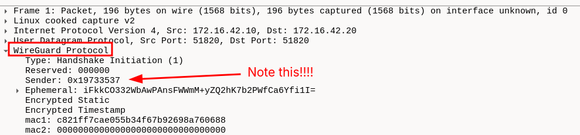
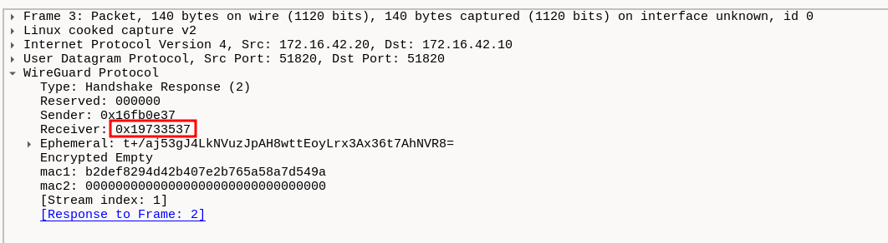
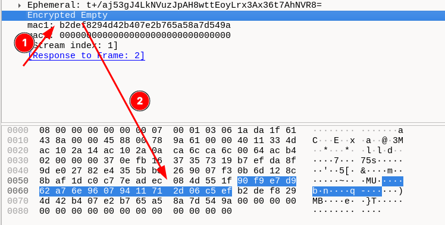
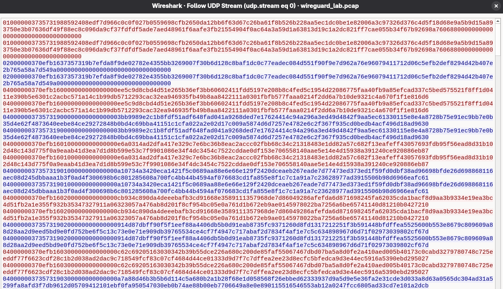
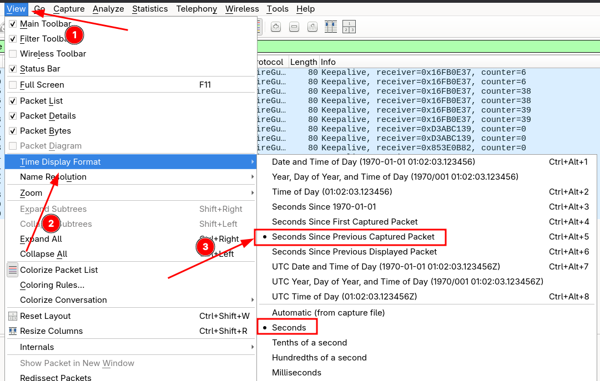

# Dissecting WireGuard Traffic

**Capture file:** `wireguard_lab.pcap`  
**Topology:**

| Role | IP Address | UDP Port |
|------|-----------|----------|
| Initiator (Peer 1) | `172.16.42.10` | `51820` |
| Responder (Peer 2) | `172.16.42.20` | `51820` |

> Both peers use port 51820 - this is a symmetric peer-to-peer setup, not a client/gateway model. The veth interfaces (`veth2c92fce` / `vethb1dbf52`) connect them inside separate network namespaces on the same host.

**Session timeline at a glance:**

| Time | Event |
|------|-------|
| 0.000 s | Handshake Initiation - Session 1 |
| ~0.002 s | Handshake Response - Session 1 |
| 0.002–30 s | 30 ICMP ping pairs (transport data) |
| ~25 s, ~50 s | Periodic keepalives (PersistentKeepalive=25) |
| ~120 s | **Rekey #1** - full new handshake (Session 2) |
| ~300 s | **Rekey #2** - full new handshake (Session 3) |
| Post-rekey | 10 ICMP pings + second keepalive window |

**Packet summary:**

| UDP Payload Length | Type | Count |
|--------------------|------|-------|
| 148 bytes | Handshake Initiation | 6 |
| 92 bytes | Handshake Response | 6 |
| 32 bytes | Keepalive (empty transport) | 16 |
| 128 bytes | Transport Data (ICMP) | 592 |
| **Total** | | **620** |

---

## Part 1 - Overview: What WireGuard Looks Like on the Wire

### Background

WireGuard is a Layer 3 VPN implemented as a Linux kernel module. Unlike IPsec or OpenVPN it uses a single UDP port and a fixed four-message-type protocol built on the **Noise_IKpsk2** handshake framework - Noise_IK extended with an optional pre-shared symmetric key for post-quantum resistance. Because everything after the handshake is encrypted with ChaCha20-Poly1305, a passive observer can determine very little about tunnelled traffic - only packet sizes, timing, and the WireGuard message type byte.

There are exactly four WireGuard message types:

| Type byte | Name | Fixed Size |
|-----------|------|------------|
| `0x01` | Handshake Initiation | 148 bytes |
| `0x02` | Handshake Response | 92 bytes |
| `0x03` | Cookie Reply | 64 bytes |
| `0x04` | Transport Data | 32 + n bytes |

Wireshark ships with a built-in WireGuard dissector (`wg` protocol) that parses these fields by name.

### Steps

1. Open `wireguard_lab.pcap` in Wireshark.

2. Apply the display filter:
```
udp.port == 51820
```
All 620 packets should appear. Note that every packet uses the same five-tuple - WireGuard multiplexes all message types over one UDP flow.


3. Apply the WireGuard-specific filter to confirm the dissector is active:
```
wg
```

4. Open **Statistics -> Protocol Hierarchy**. Observe that 100% of the UDP payload is classified as `WireGuard`. There is no TLS, HTTP, SSH, or any other application-layer protocol visible - this is the defining characteristic of a working VPN tunnel.


5. Open **Statistics -> Conversations -> UDP**. There is exactly one UDP conversation (`172.16.42.10:51820 <--> 172.16.42.20:51820`), carrying all 620 packets. WireGuard never opens additional ports or connections regardless of how many inner flows exist.


---

## Part 2 - Handshake Initiation (Type 1)

### Background

The Noise_IKpsk2 handshake is a two-message Diffie–Hellman key agreement. "IK" means the initiator knows the responder's static public key in advance (configured via `wg set`), and the initiator's static key is transmitted encrypted in the first message. This provides:

- **Forward secrecy**: fresh ephemeral Curve25519 keys per session.
- **Identity hiding**: the initiator's static public key is encrypted before transmission.
- **Replay protection**: a 12-byte TAI64N timestamp is encrypted in the message; the responder rejects any initiation with an older or equal timestamp.

The Handshake Initiation structure (148 bytes of UDP payload):
```
Offset  Size  Field
------  ----  -----
0       1     type = 0x01
1       3     reserved (must be zero)
4       4     sender_index        (u32 LE - initiator assigns, used to demux replies)
8       32    unencrypted_ephemeral  (initiator's fresh Curve25519 public key)
40      48    encrypted_static    (initiator's static pubkey + 16-byte Poly1305 tag)
88      28    encrypted_timestamp (TAI64N 12-byte timestamp + 16-byte tag)
116     16    mac1  (keyed hash over message using responder's public key)
132     16    mac2  (anti-DoS cookie - zero unless DoS threshold triggered)
        ---
        148 bytes total
```

### Steps

1. Filter to initiation packets:
```
wg.type == 1
```


**Six packets** match - one per session (three sessions, each re-initiating once). Note the timestamp clusters: `t≈0 s`, `t≈120 s` (Rekey #1), `t≈300 s` (Rekey #2).

2. Click the first initiation. Expand **WireGuard Protocol** in the detail pane. Confirm:
   - **Type**: `Handshake Initiation (1)`
   - **Sender Index**: 0x19733537 - note this value, you will verify it appears as the Receiver Index in the response.
   - **Ephemeral**: 32 bytes - a Curve25519 public key, different in every initiation even across rekeyed sessions.
   - **Encrypted Static**: 48 bytes - 32-byte pubkey + 16-byte Poly1305 tag.
   - **Encrypted Timestamp**: 28 bytes - 12-byte TAI64N + 16-byte tag.
   - **MAC1** / **MAC2**: 16 bytes each. MAC2 is all zeros - no DoS cookie was requested, confirming the peers are not under load.



3. Note what you **cannot** determine from this packet:
   - The initiator's actual static public key (encrypted)
   - Whether a pre-shared key is configured
   - Anything about the traffic that will flow through the tunnel

4. Compare the **Ephemeral** field across all six initiations, note that each one is sent twice. Every value is different - fresh ephemeral keys per handshake is what enables forward secrecy.

---

## Part 3 - Handshake Response (Type 2)

### Background

The responder receives the Initiation, authenticates the initiator's static key against its allowed-peers list, generates its own ephemeral key pair, and derives the symmetric session keys. The response is 92 bytes:
```
Offset  Size  Field
------  ----  -----
0       1     type = 0x02
1       3     reserved
4       4     sender_index    (u32 LE - responder assigns)
8       4     receiver_index  (u32 LE - echoes initiator's sender_index)
12      32    unencrypted_ephemeral  (responder's fresh Curve25519 public key)
44      16    encrypted_nothing  (empty plaintext + 16-byte Poly1305 tag)
60      16    mac1
76      16    mac2
        ---
        92 bytes total
```

After the response is sent, **both sides have independently derived the same pair of ChaCha20-Poly1305 keys** - one per direction - without any key material ever appearing on the wire

### Steps

1. Filter to response packets:
```
wg.type == 2
```


Six packets match, each paired with one initiation.

2. Click the first response. Expand **WireGuard** and confirm:
 


   - **Receiver Index** equals the **Sender Index** from the first initiation - this is how the initiator recognises the response is for its session.
   - **Sender Index** is a new value chosen by the responder.
   - **Encrypted Empty**: 16 bytes - Poly1305 tag over empty plaintext. This proves the responder holds the correct shared key material without transmitting any of it.




3. Note the round-trip time: the response arrives ~2 ms after the initiation (local veth link). This is the only observable handshake latency metric without decryption.

4. Build an index map for all three sessions. For each Init/Response pair, record:

   | Session | Init Sender Index | Resp Sender Index | Resp Receiver Index |
   |---------|-----------------|-------------------|---------------------|
   | 1 (t≈0 s) | *(from pcap)* | *(from pcap)* | = Init Sender |
   | 2 (t≈120 s) | *(from pcap)* | *(from pcap)* | = Init Sender |
   | 3 (t≈300 s) | *(from pcap)* | *(from pcap)* | = Init Sender |

   All values are cryptographically random. An adversary cannot correlate Session 2 or 3 to Session 1 from index values alone.

---

## Part 4 - Transport Data Packets (Type 4)

### Background

Once both peers have session keys, all tunnelled traffic is sent as Type 4 Transport Data. The 16-byte header:
```
Offset  Size  Field
------  ----  -----
0       1     type = 0x04
1       3     reserved
4       4     receiver_index  (u32 LE - identifies which session key to use)
8       8     counter         (u64 LE - nonce, increments per packet, replay protection)
16      n     encrypted_encapsulated_packet
              n = ⌈plaintext_len / 16⌉ × 16 + 16  (padded + Poly1305 tag)
```

In this capture every transport packet has a UDP payload of exactly **128 bytes**:
- 16 bytes WireGuard header
- 112 bytes encrypted payload = 96 bytes padded inner packet + 16 bytes Poly1305 tag

The inner packet is an ICMP echo (20 IP + 8 ICMP + 56 data = 84 bytes), padded to the next 16-byte boundary (96 bytes), plus the 16-byte tag.

### Steps

1. Filter to transport data:
```
wg.type == 4
```
**592 packets** match


2. Click any transport packet. Expand **WireGuard**:
   - **Receiver Index**: compare to the index values from Part 3 - you can identify which session this packet belongs to without decrypting it
   - **Counter**: starts at 0 per session, increments monotonically. A reset mid-session indicates a rekey; a gap indicates packet loss
   - **Encrypted Packet**: opaque ciphertext. The field length minus 16 bytes (tag) gives the padded inner size


3. Attempt to identify the inner protocol - you cannot. Right-click the packet -> **Follow -> UDP Stream** - only binary noise is visible.



4. Observe the counter sequence in one direction:
```
wg.type == 4 && ip.src == 172.16.42.10
```
Counters increment without gaps until each rekey, where they reset to 0.

---

## Part 5 - Keepalive Packets

### Background

WireGuard sends a keepalive - a Type 4 packet with **empty plaintext** - under two conditions:

1. **PersistentKeepalive**: when configured (this capture uses `PersistentKeepalive=25`), the peer sends a keepalive every 25 seconds of silence.
2. **Passive keepalive**: when a peer receives data but has nothing to send back, it sends an empty transport packet to confirm the session is alive in both directions.

A keepalive has exactly **16 bytes** of encrypted payload (the Poly1305 tag over zero plaintext). The UDP payload is therefore **32 bytes** (16-byte WireGuard header + 16-byte tag), and the UDP length field is **40** (8 UDP header + 32).

From the outside, a keepalive is **indistinguishable** from real data carrying a zero-byte payload - only the fixed 32-byte size makes it identifiable as empty.

### Steps

1. Filter keepalives by payload size:
```
wg.type == 4 && udp.length == 40
```
**16 packets** match, distributed across the two keepalive observation windows in the capture.

2. Click a keepalive. Expand **WireGuard**:
   - **Counter**: non-zero - keepalives consume counter values like real packets.
   - **Encrypted Packet**: exactly 16 bytes (tag only, no payload bytes).

3. Check keepalive timing against the `PersistentKeepalive=25` setting. Filter one direction:
```
wg.type == 4 && udp.length == 40 && ip.src == 172.16.42.10
```
Use **View -> Time Display Format -> Seconds Since Previous Captured Packet** to measure intervals. Keepalives should appear approximately every 25 seconds during silence windows.



4. Identify the handshake confirmation keepalive: immediately after each response (`wireguard.type == 2`), the initiator sends a Type 4 packet with counter 0. This is not a PersistentKeepalive - it is the message that confirms the handshake to the responder and transitions the session to active.


---

## Part 6 - Handshake Rekey

### Background

WireGuard automatically initiates a full new handshake under two conditions:

| Condition | Constant | Value |
|-----------|----------|-------|
| Time since last handshake | `REKEY_AFTER_TIME` | 120 s |
| Packets sent | `REKEY_AFTER_MESSAGES` | 2⁶⁰ packets |

The rekey is a complete Noise_IKpsk2 exchange - new ephemeral keys, new session indices, new symmetric keys. For a brief overlap window both old and new sessions remain valid, ensuring zero packet loss. The `receiver_index` in each transport packet tells the peer which key set to apply.

This capture contains **two rekeys**, producing three sessions and six total handshake messages.

### Steps

1. View all handshake messages:
```
wg.type == 1 || wg.type == 2
```
Twelve packets: three Init + Response pairs.

2. Compare the **Ephemeral** field across all three initiations. All three 32-byte Curve25519 keys are different - fresh keys per handshake is forward secrecy in action. A reused ephemeral key would allow reconstruction of session keys from a compromised static key

3. Compare the **Sender Index** values across initiations. All three are different random values. An adversary cannot link Session 2 or 3 to Session 1 via index correlation

4. After each rekey, confirm transport switches to the new `receiver_index`. Record the responder's Sender Index from Session 2's Response, then:
```
wireguard.type == 4 && wireguard.receiver_index == <session2_resp_index>
```
Only packets between Rekey #1 and Rekey #2 should match.

5. Confirm counters reset to 0 after each rekey by sorting by time and expanding the Counter field around each rekey boundary.

---

## Part 7 - What Is and Is Not Visible

### Background

This Part synthesises what a passive observer can and cannot determine. In a CTF context this maps directly to questions like "what IP is behind the VPN", "what protocol is tunnelled", or "how many sessions occurred".

### Visible to a Passive Observer

| Observable | How to Extract | Wireshark Filter |
|-----------|----------------|-----------------|
| Both endpoints' IP addresses | IP header | `ip.addr == 172.16.42.10` |
| Both endpoints' UDP ports | UDP header | `udp.port == 51820` |
| WireGuard message type | First byte of UDP payload | `wg.type` |
| Session indices | Handshake fields | `wg.sender_index` |
| Ephemeral public keys | Handshake Init/Response | expand WireGuard layer |
| Packet sizes | UDP length field | `udp.length` |
| Packet timing / inter-arrival | Frame timestamps | Statistics -> I/O Graph |
| Handshake RTT | Response ts − Init ts | - |
| Number of rekeys | Count of `wg.type == 1` | - |
| Rekey interval | Time between Init packets | - |
| Keepalive interval | Gap between `udp.length==40` type-4 packets | `udp.length == 40` |
| Traffic volume per direction | Statistics -> Conversations | - |
| Inner packet size (bounded) | `udp.length` − 40 − 16 = padded inner size | - |

### Not Visible to a Passive Observer

| Hidden | Reason |
|--------|--------|
| Inner protocol (ICMP, TLS, SSH…) | ChaCha20-Poly1305 encryption |
| Inner source / destination IPs | Encrypted in tunnel payload |
| Inner ports | Encrypted in tunnel payload |
| Static public keys | Initiator's encrypted; responder's never sent |
| Pre-shared key | Never transmitted |
| Plaintext content | Encryption |
| Exact inner packet size | 16-byte padding boundary obscures true size |
| Number of inner connections | Multiple flows may share one tunnel |
| Peer identity across sessions | Random ephemeral keys and indices per session |

### Steps

1. Try to follow the application stream: right-click any Type-4 packet -> **Follow -> UDP Stream** - only ciphertext is visible.

2. Check for leakage: **Statistics -> Protocol Hierarchy** - only `WireGuard` appears above UDP. Apply `!wireguard` - zero packets match.

3. Try decoding the payload as TLS: right-click encrypted payload -> **Decode As -> TLS** - Wireshark shows malformed TLS, confirming it is ciphertext, not a protocol record.

4. Try to determine the inner protocol from size alone. Every transport packet is 128 bytes (UDP payload). You know this encapsulates a single ICMP ping - but could you prove this without prior knowledge? Any protocol producing a packet between 81 and 96 bytes would produce the same observable size. (See Appendix C for the size estimation formula.)

---

## Quick Reference: Wireshark Filter Table

| Goal | Display Filter |
|------|----------------|
| All WireGuard traffic | `wg` |
| Handshake Initiation | `wg.type == 1` |
| Handshake Response | `wg.type == 2` |
| Cookie Reply | `wg.type == 3` |
| Transport Data | `wg.type == 4` |
| Keepalives only | `wg.type == 4 && udp.length == 40` |
| Non-keepalive transport | `wg.type == 4 && udp.length != 40` |
| Handshake messages only | `wg.type == 1 \|\| wg.type == 2` |
| Initiator -> Responder | `ip.src == 172.16.42.10` |
| Responder -> Initiator | `ip.src == 172.16.42.20` |
| Traffic after Rekey #1 | `wg.type == 4 && frame.time_relative > 120` |
| Session by index | `wg.receiver_index == <value>` |
| MAC2 non-zero (DoS cookie active) | `wg.mac2 != 00:00:00:00:00:00:00:00:00:00:00:00:00:00:00:00` |

---

## Noise_IKpsk2 Handshake Flow
```
Initiator (172.16.42.10)              Responder (172.16.42.20)
         |                                      |
         |--- [1] Handshake Initiation -------->| 148 bytes
         |    sender_index  (I chooses)         |
         |    ephemeral pubkey (unencrypted)    |
         |    encrypted static pubkey           |
         |    encrypted timestamp               |
         |    mac1, mac2                        |
         |                                      |
         |<-- [2] Handshake Response -----------| 92 bytes
         |    sender_index  (R chooses)         |
         |    receiver_index = I's sender_index |
         |    ephemeral pubkey (unencrypted)    |
         |    encrypted_nothing (tag only)      |
         |    mac1, mac2                        |
         |                                      |
         |  Both sides now hold:                |
         |  send_key  (I->R), recv_key (R->I)     |
         |  counter = 0                         |
         |                                      |
         |--- [4] Transport Data -------------->| 128 bytes (ICMP in this lab)
         |    receiver_index = R's index        |
         |    counter (nonce, increments)       |
         |    ChaCha20-Poly1305 ciphertext      |
         |                                      |
         |        ... data flows ...            |
         |                                      |
         |  @ REKEY_AFTER_TIME (~180 s):        |
         |--- [1] New Handshake Init ---------->| full rekey
         |<-- [2] New Handshake Response -------| new indices, keys, counter -> 0
         |--- [4] Transport (new session) ----->|
         |                                      |
         |       (two rekeys in this capture)   |
```


